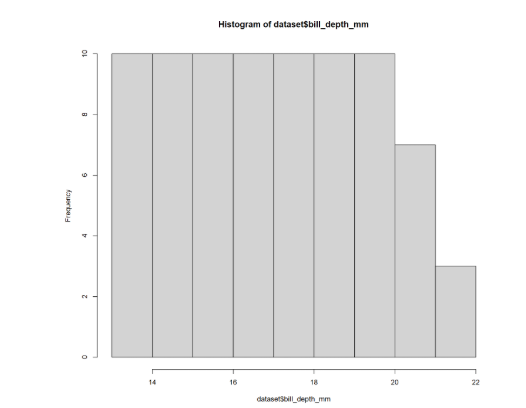
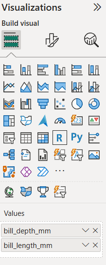
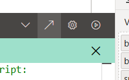

```{r}
#| echo: false
#| results: asis
#| fig-align: left
#| fig-height: 0.6
#| fig-width: 3

source(here::here("R/feed_block.R"))
# feed_block("PowerQuery - a practical introduction")
feed_block(params$id)

```

## Welcome

This is an intermediate-level session (🌶🌶) introducing some ways of using R scripts in Power BI.

The infrastructure for this session is unusually complicated, so please don't be too disappointed if not everything we demonstrate in the session works for you. As a minimum, you’ll need the following to complete the session:

- Power BI Desktop
- a working **desktop** R installation of some kind
- prior experience of building simple dashboards in Power BI (loading data, basic wrangling, visualisations)
- happy writing R code

## Setup

- create a new blank report in Power BI
- load the [penguins dataset](https://quarto.org/docs/computations/palmer-penguins.csv) from the web (`https://quarto.org/docs/computations/palmer-penguins.csv`) - anonymous access is fine if you get a content warning, and you might also need to ignore privacy checks for this file too
- you might also rename that data set to `penguins` to save typing later on in the session

## Overview

There are two places where R scripts can be used in Power BI:

1.  in PowerQuery to help ETL (see [related session](r_power_query.html))
2.  in Power BI proper, to produce visuals

There's a common approach though, which is basically:

1.  Power BI sends data to R as a data frame named `dataset`
2.  You write an R script directly in Power BI - or, in Power BI only, using an external IDE like Rstudio
3.  That script runs using your local R installation
4.  Power BI takes whatever it returns and uses it

## R versions

You may need to set your preferred R version (and IDE) using the main options menu:


I'd be very careful with this, especially if you have multiple versions, because your version will likely determine which libraries you have available in R here, so proceed with caution. But probably the latest version would be most likely to work properly?

## A first visualisation

Power BI uses R just to generate visuals. That means that the output of your script needs to make a png. There are lots of ways to do that, but the briefest is with base R's `plot()`.

- in your new report, insert an R visual - you may need to `Enable script visuals` depending on your Power BI version etc
- we need to add some data before we can edit our R script. from the `penguins` data, drag the `bill_depth_mm` column to the R script visual values field
- then, at the foot of the R script editor, plot a simple histogram using `hist(dataset$bill_depth_mm)`
- that should generate a simple (fairly dull) histogram plot for us on our report page:



## More data

We can continue to add columns to the values field on our R script visual, and they'll become available for use in R

- add the `bill_length_mm` column 
- tweak your code to plot length against depth: `plot(dataset$bill_length_mm, dataset$bill_depth_mm)` would be very suitable

## Packages

Load packages in the usual way: I tend to do this by namespacing via `package::function`, but `library(thingy)` will work fine too. It's using your local package library, so you may need to do a bit of dancing around between Rgui/Rstudio and Power BI if you need to add brand new packages.

- convert your base-R plot to use ggplot2
- now add `species`, and plot the different species as different colours
- yes, there's no proper indenting, and it's very annoying!
- it's also usual for the visuals to come out very small on the report page, so a bit of `theme_minimal(base_size = 24)` is probably warranted

## A better way of writing R code



+ use the arrow to open your code in your external IDE (like Rstudio)
+ much better support for the code, at the price of some gumpf in the headers to handle the data loading
+ also lets us understand how Power BI passes data over to R - basically just the columns you add to the visual
+ try now adding a slicer on `island` to your report page, and repeating the open in Rstudio process - you'll see the filtering of the data in action

## Publishing 

+ try publishing your report to your own workspace
+ then open in browser
+ note there's something funny going on here with packages. As the R code is now executed in the cloud, rather than on your machine, the remote R installation can only use a [select list of packages](https://learn.microsoft.com/en-us/power-bi/connect-data/service-r-packages-support) 
+ it's worth testing publishing frequently, as it reveals many subtle limitations of R use that appear to work flawlessly in Power BI Desktop


## Limitations

+ create a new R visual, add any column as data, and then repeat your graph code. This time though load the data directly from source using `readr::read_csv("https://quarto.org/docs/computations/palmer-penguins.csv")`. Now publish. What happens?

+ try returning a table of data

```{r}
#| eval: false
library(gridExtra)

dataset |>
  head() |>
  grid.table(rows = NULL, theme = ttheme_minimal(base_colour = "brown", base_size = 20))
```


+ try some code that depends on a private package

```{r}
#| eval: false
KINDR::training_sessions(output_type = "tibble") |>
  ggplot() +
  geom_histogram(aes(x = lubridate::floor_date(start, unit = "months")))

```

+ do some plotly!

```{r}
#| eval: false

library(plotly)

dataset |>
  plot_ly(x = ~bill_length_mm, y = ~bill_depth_mm, type = "scatter")
```


