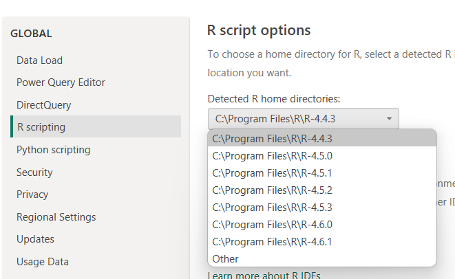
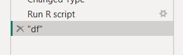
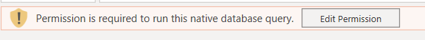
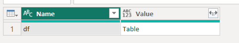

```{r}
#| echo: false
#| results: asis
#| fig-align: left
#| fig-height: 0.6
#| fig-width: 3

source(here::here("R/feed_block.R"))
# feed_block("PowerQuery - a practical introduction")
feed_block(params$id)

```

## Welcome

This is an intermediate-level session (🌶🌶) introducing some ways of using R scripts in PowerQuery

The infrastructure for this session is unusually complicated, so please don't be too disappointed if not everything we demonstrate in the session works for you. As a minimum, you’ll need the following to complete the session:

- Power BI Desktop
- a working **desktop** R installation of some kind
- prior experience of doing simple work in PowerQuery (and ideally a bit of experience with PQM formulas)
- happy writing simple R code

## Setup

- create a new web query in PowerQuery
- load the [penguins dataset](https://quarto.org/docs/computations/palmer-penguins.csv) from the web (`https://quarto.org/docs/computations/palmer-penguins.csv`) - anonymous access is fine if you get a content warning, and you might also need to ignore privacy checks for this file too
- you might also rename that query to `penguins` to save typing later on in the session

## Overview

There are two places where R scripts can be used in Power BI:

1.  in PowerQuery to help ETL
2.  in Power BI proper, to produce visuals (see [related session](r_power_bi.html))

There's a common approach though, which is basically:

1.  PowerQuery sends data to R as a data frame named `dataset`
2.  You write an R script directly in Power BI - or, in Power BI only, using an external IDE like Rstudio
3.  That script runs using your local R installation
4.  Power BI takes whatever it returns and uses it

## R versions

You may need to set your preferred R version (and IDE) using the main options menu:



I'd be very careful with this, especially if you have multiple versions, because your version will likely determine which libraries you have available in R here, so proceed with caution. But probably the latest version would be most likely to work properly?

## A first script

- in your `penguins` query, select `Run R script` in the `Transform` menu
- you'll see the dialogue giving you your `dataset` object
- try a simple re-assignment `df <- dataset`
- that, unusually, will create **two** steps: one where the R script runs, and a second where the `df` object is returned to PowerQuery



## What's going on here?

Here's my R script line of PQM: `= R.Execute("df <- dataset",[dataset=#"Changed Type"])`. This line contains my whole R script as the left-hand side of `R.Execute`. Note that multiple lines get smooshed together, using `#(lf)` as a separator.

The query also specifies what dataset itself contains in the final part of the PQM expression. R objects are created by assigning a name (PQ calls them parameters) to a step or another query. If you're brave, you can edit both sides of the `R.Execute` directly to e.g. create multiple R objects, or to tweak code.

Do note you might need to twiddle permissions if you do get brave and write your R code directly in the formula bar: 

The R script returns a table of results to PQ, with one row per object created:



In the second step, PQ then selects one of the R objects you created, and passes its values back as an ordinary PQ table: `= #"Run R script"{[Name="df"]}[Value]`

## One dataset in, multiple objects out

Go back and re-edit the script step to repeat the re-assignment:

```{r}
# 'dataset' holds the input data for this script

df <- dataset

df2 <- dataset
```

Next, at the end of your applied steps, add a new step, and add the following PQM formula:

```         
= #"Run R script"{[Name="df2"]}[Value]
```

This will return the `df2` object you made in R to PQ.

Once you've checked your results, please delete that new step, and ammend your R script to remove the re-reassignment to create `df2`

## Packages

At this stage, using packages will depend on your local R installation.

[Definitely check you're using the right version of R](images/clipboard-591608902.png)

Now attach the dplyr package, and add a count expression to your `df`

```{r}
library(dplyr)

df <- dataset |>
    count(species)
```

You should see that the column names in your PQ dataset are copied over to R. Note that PQ is a bit more lax about what can be a legal column name than R, so make sure you know how to quote an odd column name in R. e.g.

```{r}
df <- dataset |>
    count(`species`) # with backticks, not quotes
```

## Limitations

+ no external editor support
+ tibbles/data.frames only, no vectors/lists etc
+ perfidious re: bringing in data directly from R
+ limitations around custom, proprietary, or unusual, packages in Power BI
+ no support for merging multiple queries in R: one object in!
+ local scope, so no defining R functions to use in lots of queries

## Ideas

```{r}
dataset |>
    readr::write_csv("C:\\escapee.csv")
```

```{r}
df <- file.choose() |>
    readr::read_csv() # possible, but messy
```

```{r}
dataset|>
  dplyr::group_split(species) |>
  `names<-`(unique(sort(dataset$species))) |>
  list2env(.GlobalEnv)
```

Source step: `= R.Execute("file <- readr::read_csv('C:\\file.csv')")`

With thanks to Andrew Young (NHS Greater Glasgow and Clyde), there's an excellent way of improving the error handing using `tryCatch`:

```{r}
df1 <- tryCatch(
  {
    df |>
      filter(speies == "Gentoo") |> # nb spelling
      slice_head(n = 5)
  },
  error = function(e) {
    tibble::tibble(Error = e$message,
                   cause = conditionMessage(e$parent))
  }
)
```

