```{r}
#| echo: false
#| results: asis
#| fig-align: left
#| fig-height: 0.6
#| fig-width: 3

source(here::here("R/feed_block.R"))
# feed_block("Scope of the possible with Power BI")
feed_block(params$id)

```

## Why this session?

- Power BI is genuinely useful for health and care work
- but (like always) that recommendation comes with quibbles and qualifiers
- this session = non-technical, unvarnished advice about what Power BI does, where it shines, how it might help your service, and ways of putting it into action


## Session outline

- what's Power BI
- build-a-dashboard demo
- strengths and weaknesses
- alternatives
- skill development

## Power BI?

- tool to build interactive dashboards
- newish (c.2015), proprietary, paid-for
-   integrates functions from several Microsoft data products (bits of Excel, PowerPivot, PowerQuery..., SQL reporting products)
- a terminal analysis product: designed to make dashboards that users can use, rather that wrangle data/do statistical analysis

## Power BI demo

We'll use a pair of Excel files. These are based on three datasets from the [Scottish Health and Social Care Open Data portal](https://www.opendata.nhs.scot/):

- [GP practice size data](data/apr_2024_clean.xlsx) - which is based on the [GP practice details dataset](https://www.opendata.nhs.scot/dataset/gp-practice-contact-details-and-list-sizes) and the [Health Board 2014 - 2019 dataset](https://www.opendata.nhs.scot/datastore/dump/652ff726-e676-4a20-abda-435b98dd7bdc?bom=True)
- [Demographic data](data/gp_demographics_pivot.xlsx) - which is based on the [GP practice populations dataset](https://www.opendata.nhs.scot/dataset/e3300e98-cdd2-4f4e-a24e-06ee14fcc66c/resource/3306ab5a-cd22-494a-be76-ee6753cef92d/download/practice_listsizes_apr2024-open-data.csv)

```{r}
readxl::read_xlsx("data/apr_2024_clean.xlsx") |>
    dplyr::slice_sample(n = 3) |>
    knitr::kable(caption = "GP practice data")
```

## Load some data

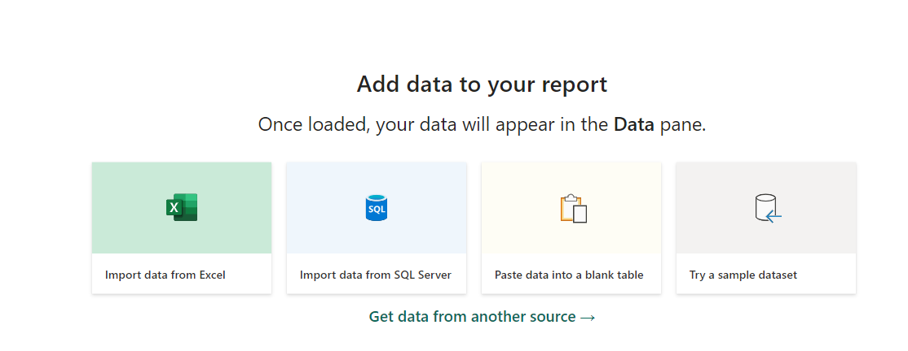

## Preview

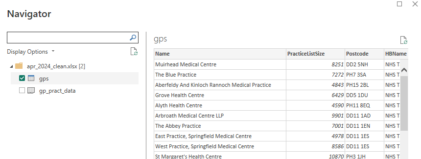

## Add to a map

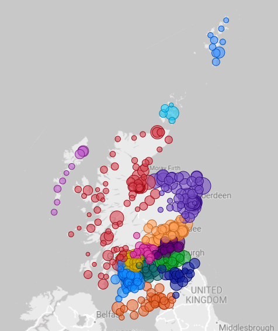

## Add interactions

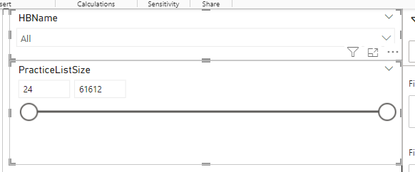

## Publish

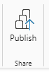

## Add more visuals

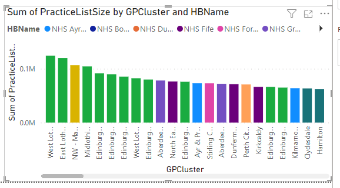

## Add more data

-   we could add the [health board names](https://www.opendata.nhs.scot/dataset/geography-codes-and-labels/resource/652ff726-e676-4a20-abda-435b98dd7bdc), to make our visual more useful
-   we could also get [GP practice demographics](https://www.opendata.nhs.scot/dataset/gp-practice-populations)

## Add more data

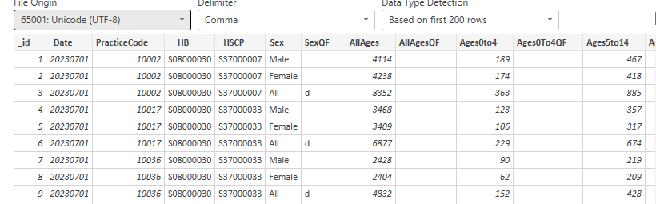

## Re-shape that data

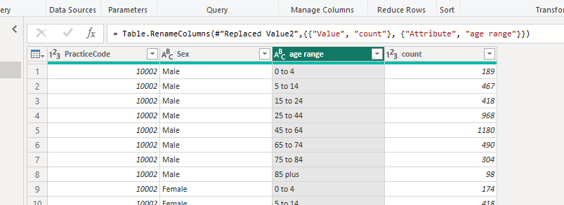

## Data modelling tools

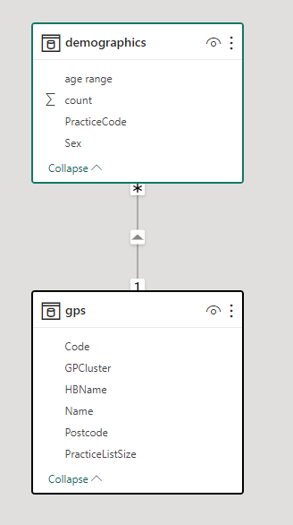

## Pre-packed visuals

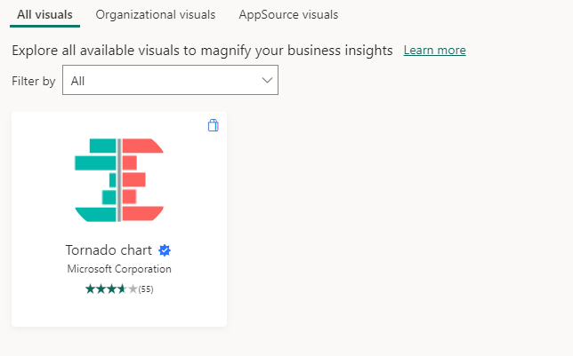

## Demographics

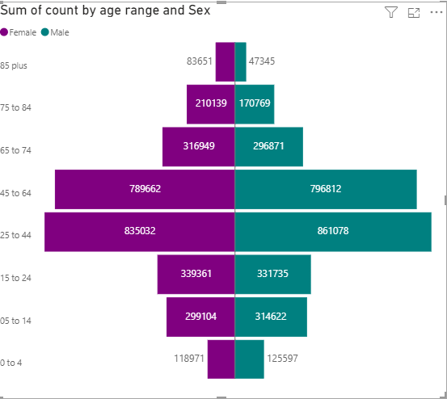

## Strengths

-   by far the easiest way of producing simple interactive data products
-   great tools for tidying data and wranging data sources
  - shines as a way of data hubbing / self-service data
  - happy with bigger data than Excel can handle
-   nice iterative workflow
-   scales well, especially if you're working for a very large number of users
-   potential to manage complex and sensitive data on existing infrastructure

## Weaknesses

- terminal analysis product. Don't expect/try to get data out of Power BI, it's absolutely not designed to be used for that
- [users need to be licenced](https://learn.microsoft.com/en-us/power-bi/fundamentals/media/end-user-license/power-bi-dedicated.jpg)
- cross-organisation use is really messy
- adding extra features (real-time data, e.g.) can be complicated and expensive
- steepening pain curve. Easy to start projects, but more involved analysis is messy
- complex IG landscape - reminder for NHS colleagues about [national guidance on Power BI](https://scottish.sharepoint.com/sites/NHSSNationalM365ServiceHub/SitePages/TT_Home.aspx?xsdata=MDV8MDJ8fDE1Zjk0YTRkMjYwZjQwYTExZjI4MDhkZTRkMDY0ZDRhfDEwZWZlMGJkYTAzMDRiY2E4MDljYjVlNjc0NWU0OTlhfDB8MHw2MzkwMzI4ODY1OTUwMzQ5MjB8VW5rbm93bnxWR1ZoYlhOVFpXTjFjbWwwZVZObGNuWnBZMlY4ZXlKRFFTSTZJbFJsWVcxelgwRlVVRk5sY25acFkyVmZVMUJQVEU5R0lpd2lWaUk2SWpBdU1DNHdNREF3SWl3aVVDSTZJbGRwYmpNeUlpd2lRVTRpT2lKUGRHaGxjaUlzSWxkVUlqb3hNWDA9fDF8TDJOb1lYUnpMekU1T2pFNFlURmtNVE15TFdFMllUY3ROR014TUMxaU1tTXlMVE13WVRNM1lUTXhNekZpWkY4MVpEa3labVEzWlMwMU5tSTVMVFE0T1RJdFlXSTNOeTA0TkdGa056VmpNall3WVRCQWRXNXhMbWRpYkM1emNHRmpaWE12YldWemMyRm5aWE12TVRjMk56WTVNVGcxTnpRME53PT18YTViYjEyZmZkMzNkNGM2MGQwYWMwOGRlNGQwNjRkNDl8OTdiY2FjOGQ5M2UwNGM4Mjk3Mjk0YjdkMDMyZmMwMDQ%3D&sdata=TVVxaS9WVHh2MG41UzhFT3hlTXk5aWRocC90RGt5RVRkZHlnb0hyeWc1ND0%3D&ovuser=10efe0bd-a030-4bca-809c-b5e6745e499a%2Cbrendan.clarke2%40nes.scot.nhs.uk&OR=Teams-HL&CT=1767692202959&clickparams=eyJBcHBOYW1lIjoiVGVhbXMtRGVza3RvcCIsIkFwcFZlcnNpb24iOiI0OS8yNTExMzAwMTMxMiIsIkhhc0ZlZGVyYXRlZFVzZXIiOmZhbHNlfQ%3D%3D)
- low-code, rather than no-code


## Alternatives

* R/Shiny - potentially free, flexible, code-based, requires infrastructure, unclear governance landscape
* Tableau - non-free, non-code-based, no infrastructure

## Training

```{r}
KINDR::training_sessions("Power BI", session_level = "beginner")
```

## Training


```{r}
KINDR::training_sessions("Power BI", session_level = "intermediate")
```


