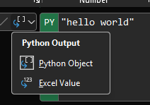
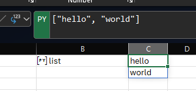
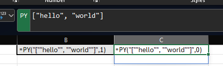
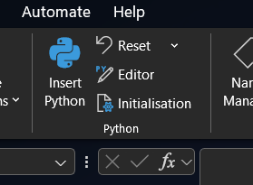
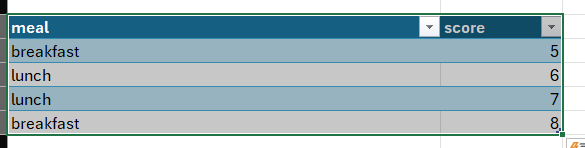
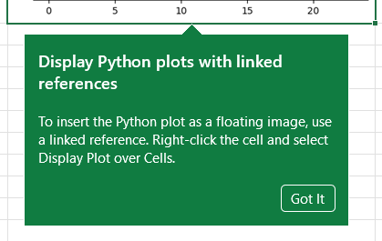

```{r}
#| results: asis
#| fig-align: left
#| fig-height: 0.6
#| fig-width: 3

source(here::here("R/feed_block.R"))
# feed_block("Logic in Excel")
feed_block(params$id)
source(here::here("R/next_sesh.R"), local = T)
next_sesh(rmarkdown::metadata$title)
```

## Welcome

- this session is for 🌶🌶🌶 advanced Excel users, who are confident writing complex formulas, and ideally have a bit of prior Python (or similar coding) experience

## Acknowledgements

## Session outline

This is still **extremely** early in development, so tba.

## Hello world

- in a cell, add the formula `=py("hello world")` and green tick
- several things to note:
  - Non-standard formula bar
  - Remote execution of that code
  - Implicit print
  - Effectively nesting Python code inside `PY()` function (Inspect Formulas)
  - `Ctrl` + `Enter` to commit

## Return values

- `PY()` has a choice of return values



## Reminder about array formulas

- array formulas produce several values from one cell of formula
- `=RANDARRAY(3, 1)`, for example
- new and alarmingly experimental in places. Especially, note conflict with tables

## Python list

- Update your python Code to `["hello", "world"\]`
- this creates a [List](https://www.w3schools.com/python/python_lists.asp)
- copy paste that formula to another cell
- now switch outputs of one from `Python Object` to `Excel Value`
- Look at the output - Excel is an array, Python a list \n 
- Inspect formulas - different return value argument inside `=PY()` \n 

.[arrayPreview] to show values from Python preview

## Python tools



## Excel values into Python

- `xl()` with a valid Excel reference or name
- single cell via A1 or name
- table or table column by name or structured reference

## DataFrame

We'd probably be better thinking of this as a method of using Pandas in Excel, rather than Python

- create a table with a named column containing numeric values
- `=PY()` with Excel Values using `xl("Table2[val]").head()`

## A major annoyance

- `xl()` defaults to taking values without headers, basically preventing the use of selection by column name
- `xl("Table2[#All]", headers=True)`
- list of column names for many cols `xl("Table2[#All]", headers=True)[["val2", "val"]]`

## Define objects

- `df = xl("Table2[#All]", headers=True)`
- `df[df["val"] > 5]`

## .loc/.iloc

- `df.loc[df["val"] > 5, "val2"]` = label-based selection
- `df.iloc[2:4]` = index-based selection

# Summaries

- `df["val"].mean()`
- `df["val"].describe()`

## Meals



```         
meals = xl("meals[#All]", headers=True)

meals.groupby("meal").mean()
```

- do `meals.groupby("meal").value_counts()` and show dynamic array
- `meals.pivot_table(columns=["meal"], values="score")`
- `meals.plot()` and linked references  \n

```{}
meals["occurrence"] = meals.groupby("meal").cumcount()

meals.pivot(index = "occurrence", columns = "meal", values = "score")
```


## Objects are scoped to the workbook