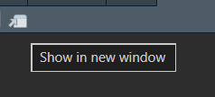
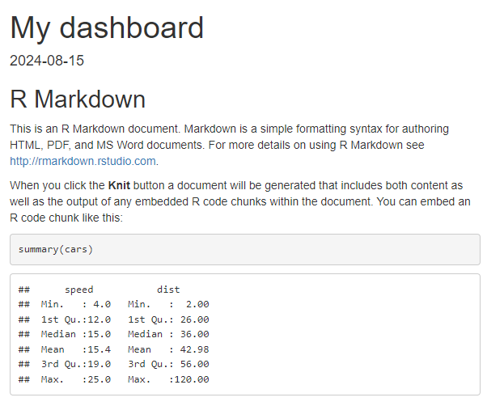
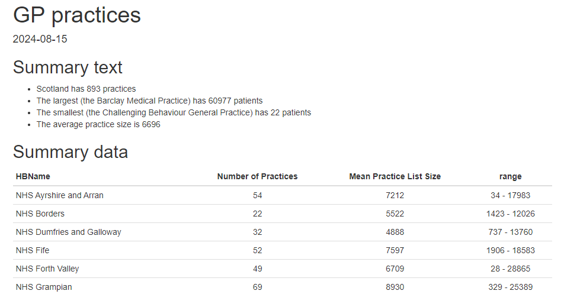
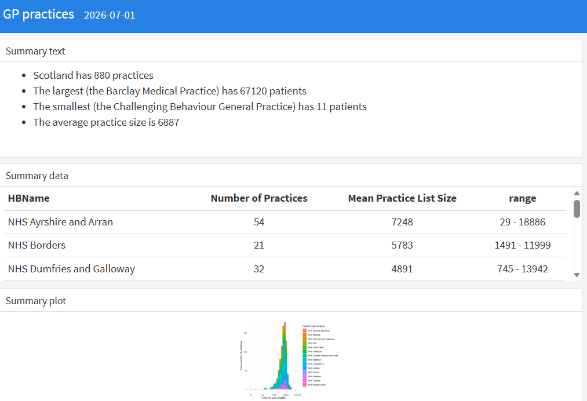
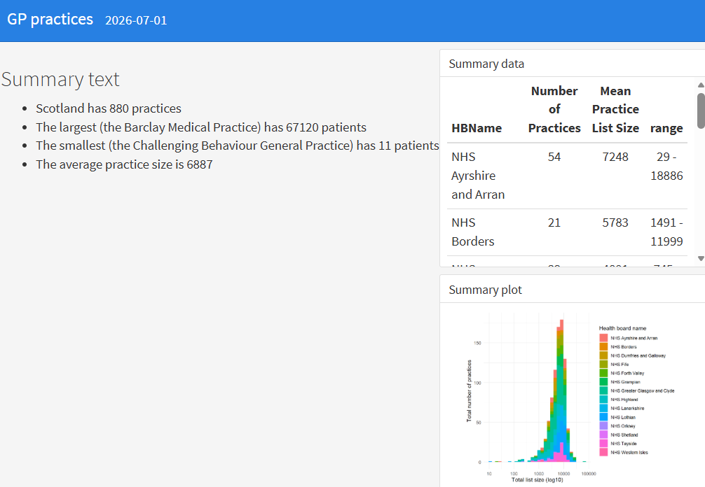
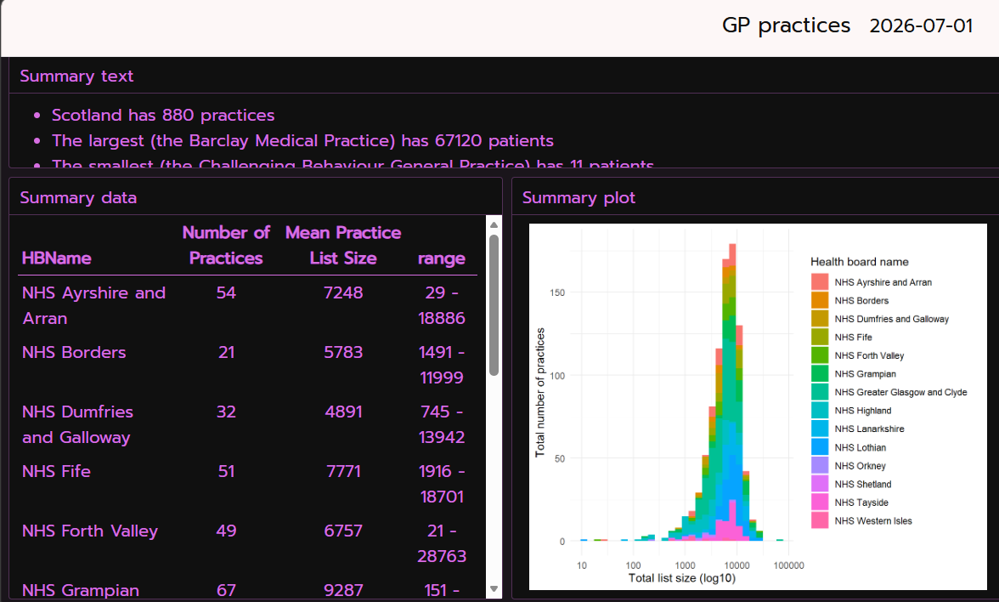

## About this session

This is a quick and friendly introduction to the [flexdashboard](https://rstudio.github.io/flexdashboard/) package, which allows you to produce static dashboard pages using Rmarkdown. We'll give a basic introduction to the package, and talk about a few useful additions - like [crosstalk](https://rstudio.github.io/crosstalk/) - to help you get up and running with some simple dashboards.

:::{.callout-tip collapse=false appearance='default' icon=true}
## Session resources

- you don't need any of this sample data to complete the session, but if you'd like to replicate the demonstrations, here are the two datasets used in the examples:
    - [April 2026 GP practice list sizes](data/practice_contact_details_20260401_opendata.csv), from [Scottish Health and Social Care Open Data](https://www.opendata.nhs.scot/dataset/gp-practice-contact-details-and-list-sizes)
    - [NHS board names and codes](data/boards.rds), again from [Scottish Health and Social Care Open Data](https://www.opendata.nhs.scot/dataset/geography-codes-and-labels)
    
You're also welcome to have a look at the demo scripts that we'll use during the session: 
```{r}
egs <- list.files("fdb_examples") 

cat(paste0("[", substr(egs, 1, 3), "](fdb_examples/", egs, ")", collapse = " / "))
```
:::


## Why flexdashboard?

- Shiny can be a pain (messy syntax, potentially hard to style, needs a server, complicated governance)
- most dashboards don't need all the fancy stuff that Shiny can do
- flexdashboard (possibly with the addition of crosstalk) is a tool for less-interactive Rmarkdown-powered dashboards
- avoids the messy syntax, easy to style, no server needed, governance as other Rmarkdown-generated documents

::: {.callout-important collapse="false" appearance="default" icon="true"}
## Previewing your rmarkdown

- Note the built-in viewer in Rstudio doesn't really display flexdashboard properly
- You should use your web browser for previewing your work
-  will show you the preview in a browser
:::

::: {.callout-note collapse="false" appearance="default" icon="true"}
### Exercise 1: build an ordinary Rmarkdown

- in a new project, create a new .Rmd
- nothing fancy needed here, but you'll want **at least** three sections, and ideally a bit of text, a table, and a graph or two
- the boilerplate dashboard you get when creating a new `.Rmd` is perfectly fine 
- we'll use a very slightly fancier Rmarkdown using GP practice details for Scotland  for this session ([demo code](fdb_examples/ex1_standard_rmd.Rmd))
- ⚠️ make sure your main sections use level-3 headers (so `###`) ⚠️
- test that it knits properly
:::

## Adding flexdashboard

We'll now install flexdashboard, and add it to our Rmd:

::: {.callout-note collapse="false" appearance="default" icon="true"}
### Exercise 2: add flexdashboard

- in the console, run `install.packages("flexdashboard")` if needed
- edit the output section of your yaml header to `output: flexdashboard::flex_dashboard`
- add `library(flexdashboard)` to your setup R chunk ([demo code](fdb_examples/ex2_boilerplate.Rmd))
- re-knit your dashboard
:::

This will turn your Rmd into a flexdashboard of sorts:



The default layout is for each section to occupy its own row. That's okay for the summary data section here, but not very brilliant for the graph, which gets very squashed. We'll play with changing the default orientation later, but first let's look at the basics of building rows and columns.

## Rows and columns

Our dashboard uses third-level headers to mark sections, and you can see that each `###` effectively creates a new row. Let's add another layer of separators now.

::: {.callout-note collapse="false" appearance="default" icon="true"}
### Exercise 3: add another divider

- between sections one and two sections, add the following chunk of markup:

```         
Column
--------------------------------------
```

- re-knit and see if you can determine what's changed ([demo code](fdb_examples/ex3_rows_cols.Rmd))
:::

That should create a new column in your dashboard, so that the second and third rows end up stacked in a new column:



## Tweaking column widths

That layout isn't very brilliant, especially as our little bit of text occupies the bulk of the space on screen. Happily, we can tweak column widths by supplying a width in pixels. The rub here is that you'll also need to explicitly define the left-hand column in your dashboard too before that will work properly:

::: {.callout-note collapse="false" appearance="default" icon="true"}
### Exercise 4: column widths

- add another column divider to include your first section
- add a `{data-width=xxx}` to each column divider, with your choice of values (maybe 300 and 900?)

```         
Column {data-width=800}
--------------------------------------
```

- re-knit and see if you can determine what's changed ([demo code](fdb_examples/ex4_col_widths.Rmd))
:::

## Rows first?

We're basically designing columns here, and letting the `###` section dividers create rows for us. It'd also be possible to design the other way: rows first, then columns. That's achieved by playing with the orientation of the dashboard.

::: {.callout-note collapse="false" appearance="default" icon="true"}
### Exercise 5: rows first!

- first, tweak the yaml header to include an orientation key:

```         
output: 
  flexdashboard::flex_dashboard:
    orientation: rows
```

- next, change your column dividers for row dividers

```         
Row {data-height=800}
-----------------
```

- re-knit and check the behaviour ([demo code](fdb_examples/ex5_rows_first.Rmd))
:::

## Theme your dashboards

There are several ways to theme a dashboard. We'll add a theme to the main page.

::: {.callout-note collapse="false" appearance="default" icon="true"}
### Exercise 6: add a theme

- themes are set in the yaml header. There are a couple of ways of doing this. Let's look at the more manual approach first. To start, add the following to your flexdashboard section:

```         
  theme:
      bg: "#101010"
      fg: "#ED79F9" 
      primary: "#FDF7F7"
      base_font:
        google: Prompt
      code_font:
        google: JetBrains Mono
```

- re-knit and check the (hopefully pretty alarming) output ([demo code](fdb_examples/ex6_theme.Rmd))
:::



## In-built themes

As well as specifying everything about a theme piecemeal, we can also use one of the built-in themes using bslib.

::: {.callout-note collapse="false" appearance="default" icon="true"}
### Exercise 7: bslib

+ run `install.packages("bslib")` in the console
+ update the theme section of your yaml to use a bootswatch theme

```{}         
  theme: 
      version: 5
      bootswatch: minty

```
    
+ re-knit, and check your output ([demo code](fdb_examples/ex7_bslib.Rmd))
:::

 There's lots to explore in bslib, but probably the neatest way is to play with their built-in demo by running `bslib::bs_theme_preview()` in the console.
 
## Thematic

Note that our graph doesn't fit our bslib theme. Luckily, there's a tool to bring that main theme across to our ggplot: thematic.

::: {.callout-note collapse="false" appearance="default" icon="true"}
### Exercise 8: thematic

+ in the console, run `install.packages("thematic")`
+ add `thematic::thematic_rmd()` to your setup chunk
+ re-knit and check that your graph - the fonts and spacing, at least - is now re-styled to match your theme ([demo code](fdb_examples/ex8_thematic.Rmd))
+ try changing the main theme (maybe to `cyborg` or `morph`) and seeing what changes in your graph.
:::

## A bunch of bells and whistles

There are lots of useful add-ons to explore. We'll look at a few basic examples, and (via crosstalk) look at a simple-ish way of adding bits of interaction to an otherwise static dashboard.

::: {.panel-tabset}

## Tabsets
- add `.tabset` to a row/column spec

## Fancy tables 
- `DT::datatable`

## Value boxes
- with `valueBox()`

## Storyboards

```{}
  flexdashboard::flex_dashboard:
    storyboard: TRUE
    vertical_layout: fill
    self_contained: TRUE
    
```

## QDB

-   add `format: dashboard` to your yaml
-   that's it

## `crosstalk` and `leaflet` = interactivity

+ crosstalk is a way of building simple interactions into static dashboards
+ there's a [demo file for this](fdb_examples/ex9_crosstalk.Rmd)
+ lots of new packages needed (`plotly`, `viridis`, `crosstalk`, `PostcodesioR` and `leaflet`)

```{r}
#| eval: false
#| echo: true

## create a crosstalk data object with the practice code as the key
shared_gps <- SharedData$new(gps, 
                            key = ~PracticeCode, 
                            group = "gp_practices_subset")

## make a filter
board_filter = filter_select(id = "board", label = "Pick a Health Board", ~HBName, sharedData = shared_gps)
```

+ we then need to connect the shared objects with our graph and add a plotly wrapper:
```{r}
#| eval: false
#| echo: true

my_plot <- shared_gps |>
  ggplot() +
  geom_density(aes(x = PracticeListSize, fill = HBName), alpha = 2/5) +
  scale_x_log10() +
  xlab("Total list size (log10)") +
  ylab("Total number of practices") +
  labs(fill="Health board name")

ggplotly(my_plot)
```

+ that example also includes an unnecessarily fancy map with a subset of the GPs show. Again, that will show basic interactivity:

```{r}
#| eval: false
#| echo: true

gps_sm <- gps |>
  slice_sample(n = 100) |>
  rowwise() |>
  mutate(postcode_look = postcode_lookup(Postcode)) |>
  tidyr::unnest(postcode_look) |>
  select(PracticeCode, GPPracticeName, PracticeListSize, longitude, latitude, HBName) # making a small subset to keep things quick

shared_gps_sm <- SharedData$new(gps_sm, 
                            key = ~PracticeCode, 
                            group = "gp_practices_subset") # new, linked, shareddata

pal <- colorFactor(palette = viridis(length(unique(gps_sm$HBName))), domain = gps_sm$HBName)

shared_gps_sm |>
  leaflet() |>
  addTiles() |>
  addCircleMarkers(radius = ~PracticeListSize / 1000, 
                   color = ~pal(HBName))
```

:::

