```{r}
#| echo: false
#| results: asis
#| fig-align: left
#| fig-height: 0.6
#| fig-width: 3

source(here::here("R/feed_block.R"))
# feed_block("Parameterised Rmarkdown")
feed_block(params$id)
```

## Introduction

Parameterised Rmarkdown allows users to produce a group of similar documents from a single Rmd document. For example, you might need to produce similar reports for several organisations from one dataset. Rather than creating several near-identical Rmd for each organisation, a parameterised Rmd would let you write one document, and then render versions of it localised to each of the organisations you need to report for. The logic is similar to a function: rather than repeating similar blocks of code, you write one function, and then call that function as needed to produce your results.

- this is an 🌶🌶 intermediate-level practical session designed for those with prior R experience
- it's definitely meant to be a taster session, rather than a comprehensive introduction
- you'll need some kind of R setup to follow along
- you'll also need the `rmarkdown` and `quarto` packages installed

## Session outline

- basic framework
- interesting things to try
  - show/hide code
  - choose params interactively
  - knit from a function
  - use purrr (and possibly targets) to do this at scale
  - try this with Quarto

## Basic framework

We'll start with an ordinary Rmd:

::: {.callout-note collapse="false" appearance="default" icon="true"}
## Task

- create a new Rstudio project
- in it, create a new Rmd (the boilerplate one is fine) and save in the root directory of your project with a nice concise name (you'll need to type it later)
- remove all the content, so that (apart from the yaml header) there's a blank canvas to work on
- check that you can knit that Rmd (using the 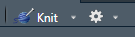 in the top bar of the source code pane, or via `Ctrl` + `Shift` + `k`)
- add a bit of content ("hello world" would be traditional) and re-knit again to check that everything is working properly
:::

## Ways of knitting

As well as knitting via the button or shortcut, you can also knit an Rmd from an R script. The key here is the function `rmarkdown::render()`. Let's try that now:

::: {.callout-note collapse="false" appearance="default" icon="true"}
## Task

- now create an R script in your project root, and save
- add a call to `rmarkdown::render()` with the filename of your Rmd file
- run that line of code - you won't see anything in your viewer, but you should see stuff happening in the console to convince you the file has knitted
:::

Now test what happens when you alter your Rmd:

::: {.callout-note collapse="false" appearance="default" icon="true"}
## Task

- alter your Rmd
- re-run the R script
- refresh your viewer pane
:::

::: panel-tabset
### Rmarkdown

```{embed, file = "src/rmd/01_rmd.Rmd"}
```

### Render code

```{r}
rmarkdown::render("01_rmd.Rmd")
```

### Output

```{r, echo=FALSE}

# rmarkdown::render("r_training/src/rmd/01_rmd.Rmd") |>
#   renderthis::to_png("r_training/images/01_rmd.png")

```

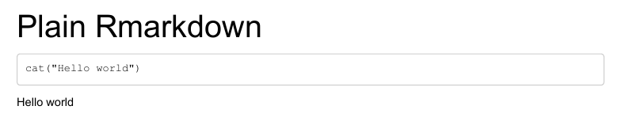
:::

## Adding options

This gets more interesting when you start specifying options inside `render()`. A basic example of this would be to change the output filename by adding `output_file`:

```{r}
rmarkdown::render("Rmarkdown.Rmd", 
                  output_file = "Rmarkdown_plain.html")
```

We could also change our output format. By default, rmarkdown docs get rendered to whatever is specified in the header. That's HTML in our case, but we could fiddle that to give us .pdf output:

```{r}
rmarkdown::render("Rmarkdown.Rmd", 
                  output_file = "Rmarkdown_plain.pdf",
                  output_format = pdf_document)
```

Note that we're still producing the same output each time, albeit with different filenames and in different formats.

::: {.callout-note collapse="false" appearance="default" icon="true"}
## Task

- try those options now: change the filename and the output format (`pdf_document` or `word_document`)
- see what happens if you provide clashing filetype extension and output format (`file.docx` and `pdf_document`, say)
:::

## Parameters

The next part is to add **params**, which will enable us to change the content. We need to make two changes to our Rmd. First, we add params in the header. Those consist of a key, which can be any valid variable name, and a default value. We can then access those params in our ordinary R code in the document by referring to them by name - like (`params$name`):

::: {.callout-note collapse="false" appearance="default" icon="true"}
## Task

- try that now by adding a `name` param to your header
- then call that name param into the body of your Rmd
- test by knitting via a method of your choice
:::

::: panel-tabset
### Rmarkdown

```{embed, file = "src/rmd/02_rmd.Rmd"}
```

### Render code

```{r}
rmarkdown::render("02_rmd.Rmd")
```

### Output

```{r, echo = FALSE}

# rmarkdown::render("r_training/src/rmd/02_rmd.Rmd") |>
#   renderthis::to_png("r_training/images/02_rmd.png")

```

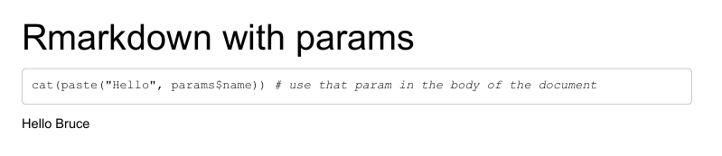
:::

We can now add some params in our render code to produce a different output. Note that, as we set defaults in the Rmarkdown header, these params are optional. But if we do include params in our render call, they will over-ride the defaults. That's done by building a list of params in the `params` argument:

::: {.callout-note collapse="false" appearance="default" icon="true"}
## Task

- add a new name to your render script
- then re-render your Rmd and check the output
:::

::: panel-tabset
### Rmarkdown

Same Rmarkdown:

```{embed, file = "src/rmd/02_rmd.Rmd"}
```

### Render code

```{r}
rmarkdown::render("02_rmd.Rmd",
                  params = list(name = "Steve")) # new param
```

### Output

```{r, echo = FALSE}

# rmarkdown::render("r_training/src/rmd/02_rmd.Rmd", 
#                   output_file = "02_rmd_steve.html",
#                   params = list(name = "Steve")) |>
#   renderthis::to_png("r_training/images/02_rmd_steve.png")

```

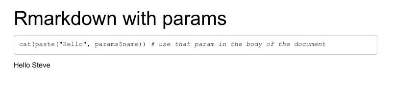
:::

You can build several params in the one document, as we'll now show, and use those parameters to dramatically change the state of the document:

## Interesting things to do with params: show/hide code

::: panel-tabset
### Rmarkdown

Add an extra param to the Rmarkdown, and link it to the chunk options:

```{embed, file = "src/rmd/03_rmd.Rmd"}
```

### Render code

```{r}
rmarkdown::render("03_rmd.Rmd",
                  params = list(showcode = FALSE)) # new param
```

### Output

```{r, echo = FALSE}

# rmarkdown::render("r_training/src/rmd/03_rmd.Rmd",
#                   output_file = "03_rmd_nocode.html",
#                   params = list(showcode = FALSE)) |>
#   renderthis::to_png("r_training/images/03_rmd_nocode.png")

```

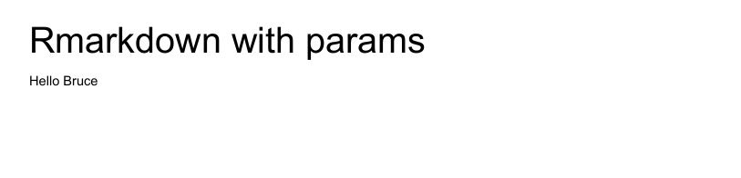
:::

## Interesting things to do with params: choose params interactively

::: panel-tabset
### Rmarkdown

With the same Rmd, we can run params interactively via a mini-Shiny app:

```{embed, file = "src/rmd/03_rmd.Rmd"}
```

### Render code

You can also access this via the knit menu: 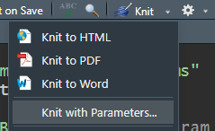

```{r, eval=F}
rmarkdown::render("03_rmd.Rmd", params = "ask") # interactive parameter choice
```

Interactive parameter chooser: </br>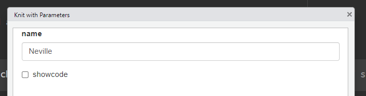{height="200"}

### Output

```{r, echo = FALSE}

# rmarkdown::render("r_training/src/rmd/03_rmd.Rmd",
#                   output_file = "03_rmd_interactive.html",
#                   params = list(showcode = FALSE)) |>
#   renderthis::to_png("r_training/images/03_rmd_interactive.png")

```

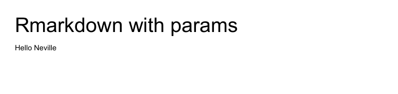
:::

## Interesting things to do with params: filter data using a param

::: panel-tabset
### Rmarkdown

With excuses for using the boring mtcars data, we can use a param value inside ordinary dplyr code:

```{embed, file = "src/rmd/04_rmd.Rmd"}
```

### Render code

You can also access this via the knit menu: 

```{r, eval=F}
rmarkdown::render("r_training/src/rmd/04_rmd.Rmd", params = list(cyl = 8)) # take care, you'll get odd results if you try and filter on values that don't exist
```

### Output

```{r, echo = FALSE}

# rmarkdown::render("r_training/src/rmd/04_rmd.Rmd",
#                   output_file = "04_rmd_choose.html",
#                   params = list(cyl = 8)) |>
#   renderthis::to_png("r_training/images/04_rmd_choose.png")

```


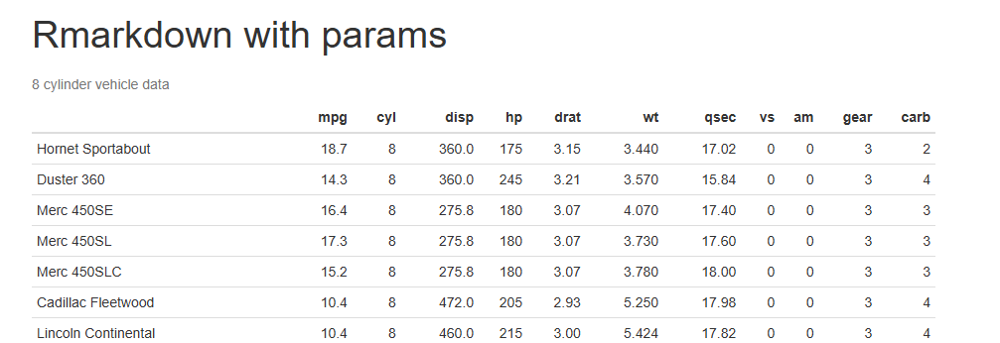
:::

## Interesting things to do with params: knit from a function

::: panel-tabset
### Rmarkdown

We'll use the previous Rmd for this example:

```{embed, file = "src/rmd/03_rmd.Rmd"}
```

### Render code

We build a function to call `rmarkdown::render()` with the right options:

```{r, eval=F}
make_mark <- function(input_name, show_code = TRUE, format = "html"){

  rmarkdown::render("03_rmd.Rmd",
                    output_file = paste0("03_rmd_", input_name, ".", format),
                    params = list(name = input_name, 
                                  showcode = show_code))
}

make_mark(input_name = "Nat")
make_mark(input_name = "Mel", format = "pdf")
make_mark(input_name = "Sue", show_code = FALSE, format = "html")

```

### Output

```{r, echo = FALSE}

# make_mark <- function(input_name, show_code = TRUE, format_type = "html"){
#   
#   rmarkdown::render("r_training/src/rmd/03_rmd.Rmd",
#                     output_file = paste0("03_rmd_", input_name, ".", format_type),
#                     output_format = paste0(format_type, "_document"),
#                     params = list(name = input_name, 
#                                   showcode = show_code))
# }
# 
# make_mark(input_name = "Nat")
# make_mark(input_name = "Mel", format = "pdf")
# make_mark(input_name = "Sue", show_code = FALSE, format = "html")

# rmarkdown::render("r_training/src/rmd/03_rmd.Rmd",
#                   output_file = "03_rmd_interactive.html",
#                   params = list(showcode = FALSE)) |>
# renderthis::to_png("r_training/src/rmd/03_rmd_Nat.pdf", "r_training/images/03_rmd_Nat_pdf.png")
# renderthis::to_png("r_training/src/rmd/03_rmd_Mel.pdf", "r_training/images/03_rmd_Mel_pdf.png")
# renderthis::to_png("r_training/src/rmd/03_rmd_Sue.html", "r_training/images/03_rmd_Sue_html.png")

```

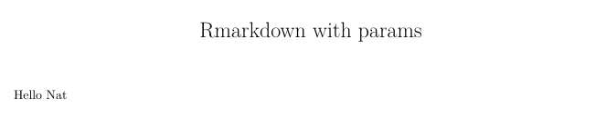

and

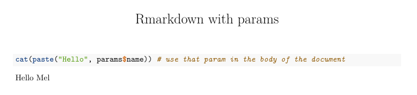

and

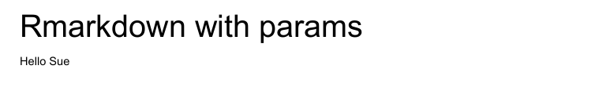
:::

## Interesting things to do with params: purrr from that function

::: panel-tabset
### Rmarkdown

Same Rmd again:

```{embed, file = "src/rmd/03_rmd.Rmd"}
```

### Render code

We'll now call our `make_mark` function using purrr. `dplyr::expand_grid()` helps set all the correct combinations up for us:

```{r, eval=F}

input_name = c("Angela", "Gloria", "Audre", "bell")
format = c("pdf", "html")

tidyr::expand_grid(input_name, format) |>
  purrr::pwalk(make_mark2) 
```

### Output

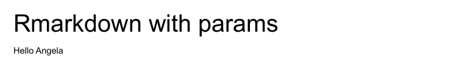

and

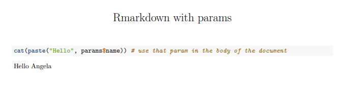

and

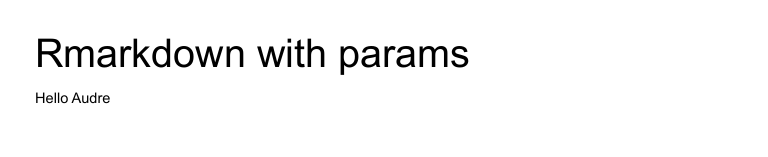

and

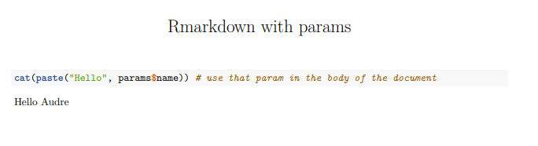

...and so on and so on.
:::

Using functional programming can lead to massive and complicated results quickly. You should probably investigate the [targets package](https://docs.ropensci.org/targets/) if you're looking to apply this at scale.

## Interesting things to do with params: use in Quarto

This parameterised approach is also applicable to Quarto.

::: panel-tabset
### Quarto

Basically the same as our Rmd with a different render function:

```{embed, file = "src/rmd/01_qmd.qmd"}
```

### Render code

```{r, eval=F}
quarto::quarto_render("01_qmd.qmd") # different render function


quarto::quarto_render("01_qmd.qmd", 
                      execute_params = list(name = "Emma")) # same way of setting params

```

### Output

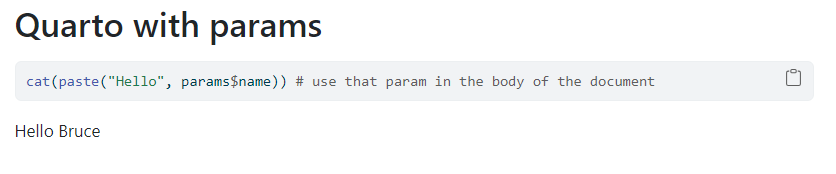

and

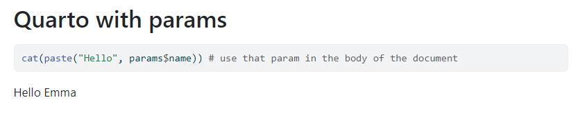
:::
