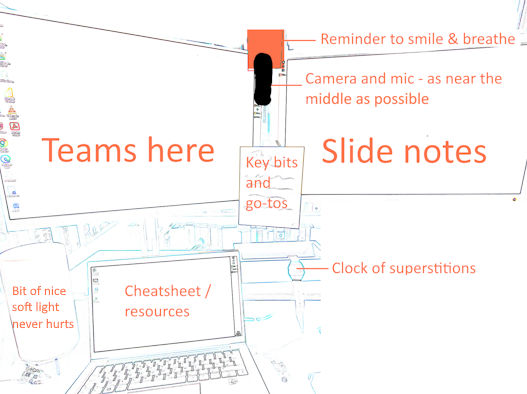

```{r}
#| echo: false
#| results: asis
#| fig-align: left
#| fig-height: 0.6
#| fig-width: 3

source(here::here("R/feed_block.R"))
# feed_block("Presenting")
feed_block(params$id)

# source(here::here("R/next_sesh.R"))
# next_sesh("Presenting")
```

## Introduction

This page contains accompanying materials for our multi-session presentation skills course. That course is aimed at people who don't do much presenting, or who have never presented before, or who have had negative experiences of presenting. Our aim is to help people build their presentation skills, and to feel more comfortable when they present. 

This course advocates for a personal approach to presenting in the professional context. We think that understanding how an audience responds to a talk is the most helpful way of developing presentation skills. That sort of engagement is served by presenting authentically, as a professional person conveying one of their enthusiasms. So this course teaches you how to find topics of interest, shape them into the skeleton of a presentation, and then give that presentation so that it lands with your audience.

The approach is collaborative, and practical. Most of the sessions involve group activities, where you can discuss, develop, and practice your presentation skills. We request that course participants really involve themselves in these group discussions, and play an active role in ensuring that the sessions are as supportive and positive as possible. We understand that presenting in public can be stressful - that's more-or-less the major premise of this course - and so we ask those joining the course to help us to build a trusting and supportive environment during the sessions. Specifically, we ask participants to follow these maxims during the course:


## A note about trust
+ we acknowledge that most of us find presenting hard
+ we will act gently and professionally in our interactions with colleagues during these sessions
+ we will give people sufficient time to speak, and space to think
+ we will avoid mocking or undermining others
+ we should avoid playing devil's advocate or being deliberately controversial
+ we will not record any of this session in any way, including using AI note-taking tools

## Course structure

The course consists of five linked sessions, and we ask participants to try and attend all five sessions in a block. In session one, we explore the idea that presentation skills are teachable, think about how we find interesting things to talk about, and start thinking about the recipe that we'll use for turning a topic into a talk. In session two, we take that topic from the previous session and use a thinking-partner conversation to help you shape that topic to suit your talk, especially concentrating on ways of making your topic interesting, and starting to plan out sections of a presentation. Session three then takes that plan, and starts developing a script that you can use to deliver a simple presentation. In session four, you'll then practice that presentation in very small groups, with the aim of providing mutual feedback and support as a way of understanding and improving your own presentation. Finally, in the last session, we'll hear some example presentations delivered to the whole group, and think more about how to give and get feedback on a presentation.


## Session outlines

::: {.panel-tabset}

## Session one: this isn't about personality


:::{.callout-note collapse=false appearance='default' icon=true}
## Session objective
To understand that presentation skills aren't innate: they're learn-able, and teachable
:::


### Session outline

+ why think about presentation skills?
+ find a topic
+ a minimal set of advice
+ an opportunity to practice
+ additional advice, questions, and chatter

### Sample script

Here's a [sample script for this session](src/presenting_person_s1.pdf)

### Presentations are just conversations with extra steps

### Find a topic!

+ here's something I experienced
+ here's something I love
+ here's something I read

### Topic suggestions

+ hobby, sport, personal best
+ new work achievements
+ new skills and talents

### Topics aren't talks!

+ what would you be curious about
+ think conversation: what's your first question?
+ topic = anticipating questions and starting a conversation

### Turning a topic into talk

+ tell me why you're talking about your topic
+ what's interesting, specifically
+ include specific engagement (provocation/mystery/anti-common knowledge)
+ include interaction


### Why think about presentation skills?

+ possibly the ultimate in transferable skills
+ most people are terrible at presenting
    + presenting differs from listening in non-obvious ways
+ but you can improve easily and cheaply

### A minimal set of advice

1. Be simple
1. Be keen
1. Be human


## Session two: planning your topic

:::{.callout-note collapse=false appearance='default' icon=true}
## Session objective
To identify a presentation topic, and start developing a plan for your presentation
:::


### Key presentation advice: be simple
+ good presentations concentrate on the most interesting material
    + if in doubt, take it out
+ in this session, we're going to cover a recipe for finding that interesting material from a topic

### Why not just say everything?

+ the asymmetry of presentation:        
    + you'll know much more than your audience
    + so you'll worry about details, not basics
    + but your audience will need the basics, not the details
+ simple = clear = interesting
+ a reminder about [Kahler's drivers](https://learn.nes.nhs.scot/27427)
    + "Be perfect" vs "Please people"

### A demonstration of what we're doing today: 'Thinking partner' conversations

* start with a topic
* sit with a partner for a few minutes to discuss
    * what that topic means to the partner (background knowledge)
    * how to make that interesting for the audience
    * what the key points are to include
    * any suitable interactions you might use

### Task: thinking partner conversations
+ you need a topic (from the homework from last week)
+ in pairs, please:
    * give the partner a 1-2 sentence introduction to the topic
    * ask what that topic means to the partner (find out about their likely background knowledge)
    * then ask questions to find out what's most interesting
    * what the key points are to include that require explanation etc
    * any suitable interactions you might use


### Feedback

* What did you find surprising about those conversations?


:::{.callout-note collapse=false appearance='default' icon=true}
## Homework

You've now (hopefully) had a good discussion about your theme. Your homework task for the week is to write that down, and think about the points you want to make, and the interactions you'll want to include, in your talk. 

Next week, We're going to start turning that plan into a script.
:::

## Session three: from plan to script

:::{.callout-note collapse=false appearance='default' icon=true}
### Session objective

Session aim: take a plan around your topic, and turn it into a script that you can use for a short presentation on a topic of your choice
:::

### A word of warning

+ there are lots of different schools of thought about how to plan talks
  + some emphasise the art of building something engaging
  + others emphasise the craft of making sure everything is in its right place
+ in this session, we're doing a bit of both, but leaning towards the craft
  + there's a risk here of making planning seem more mechanical than it actually is
  + because this is *presenting like a person* rather than *presenting like a robot* we'll do some work to push back on excessive craftiness next time
  
:::{.callout-note collapse=false appearance='default' icon=true}

### Task

+ from last time, write down a sentence describing your topic
+ then add:
  + any essential ideas you wanted to include
  + any interactions you fancied
  + any ideas you had about your audience

:::


### Recursive planning

+ a way of taking your topic, and making sure that all the things you say about it fit together properly
+ definitely on the craft side of the planning spectrum 

### Recursive planning

+ you now need 3-5 points that:
    + support/explain/make up your main point
    + each point should be a simple sentence
+ if you're writing a very long/complicated talk, then you might go again (and again)
    + but you should almost certainly stop one layer of detail before you think you've said enough

### Example

+ "I managed to fix my booking system"
    + "booking clinic slots was done manually"
    + "that was slow and error-prone"
    + "I used Power Automate + very strong language to automate it"
    + "I had to learn to use `Apply to Each` to get that to work"
    + "I am now thinking about automating my other clinic bookings"
    
### Structuring

+ there are several different ways to structure your points
+ chronological - talking about things in the order they happened - is usually a sensible default
+ but you could do problem-to-solution, or particular-to abstract too


:::{.callout-note collapse=false appearance='default' icon=true}

### Task: support your sentence

+ solo, right here, and we'll spend c.5/6 minutes
+ take your topic, and break it down into 3-5 points that you fancy talking about
+ try and order them sensibly
+ try and think about fitting the points to your intended audience
+ if in doubt, take it out
:::

### How did you get on?

### Constraints
+ take your plan, and chop it down to size by considering:
    + how long do you have to speak, exactly?
        + one point every two minutes is pretty good going
    + how long do you have to prepare?
    + who are your audience?
        + the less closely they're related to your work, the less material you're going to cover
    + how big is the audience?
        + bigger = messier = less detail

### Then make it interesting
+ back to the art-side!
+ think of this (probably quite boring) plan as a framework that you can hang enticing bits on
+ some suggestions:
  + your interactions
  + structural clues: something telling the audience what to expect
  + a hook: something at the beginning that interests/annoys/entertains people (and tells them what your topic is about)
  + a punchline: something at the end that sums up what you've been saying
        
### Prep time

+ if you're new at this, or it's important, I would budget a **huge** amount of time to prepare
    + one hour preparation per minute of speaking (seriously)
+ this time isn't for doing the work you're presenting
    + it's just for planning the presentation
+ beware procrastination by optimization (especially making slides before you've decided what you're going to say)

### Slides

+ we're not going to get you to make slides for this course
+ but if you do need slides, your recursive plan is solid gold:
    + recursive plan + pictures = slides
+ general advice:
    + fewer than 20 words per slide
    + usual advice is 2 minutes per slide
    + put your details at the start and end


## Session four: practice and tips

:::{.callout-note collapse=false appearance='default' icon=true}
## Session objective

Session aim: deliver your presentation and receive feedback, and be a good audience for other presentations
:::

:::{.callout-note collapse=false appearance='default' icon=true}

### Practice time!

+ we'll work in pairs
+ you've got a sentence, and 3-5 supporting bits
+ we're going to get you to present for **two minutes** only, no visual aids - just chat
+ we'll pause here to let everyone put their sentences in order 
+ then into pairs:
    + one minute to find your feet
    + two minutes presenting
    + one minute of gentle, constructive, and positive feedback
    + then swap
    
:::

### How to be simple?

+ apply a hierarchy
+ recursive planning
+ use your constraints

### The hierarchy

+ you'll need a single sentence that sums up your presentation
    + everything else comes from this
+ ideally you'll have it in mind before you start
    + but it often changes
+ this is non-negotiable, and much harder than it looks

### Be human

+ don't try and cover everything
+ absolutely leave time for Q+A (and ideally a bit of random chat) at the end
+ don't apologise, but do admit when things go wrong
    + there's asymmetry here too: your clunker will look like a mini-hitch to the audience

### Don't be bland!

+ think about a memorable talk: personable speaker engaging with the audience
+ the most unprofessional thing = to squander people's time and attention
+ being a person is allowed, beneficial, great

### Make it easy for yourself



### Tech
+ it's hard to give general advice, but think carefully about your specific tech
+ tech often malfunctions during presentations, so you might have a backup (e.g. what to do if you can't show your slides?)
+ you'll also be more likely to make mistakes with the tech when speaking

### Be keen
+ enthusiasm for your work, for your audience, and for what you're presenting about is the easiest way to come off as knowledgeable and interesting
+ plenty of preparation helps
+ but for most of us this is scary
+ fake it with socially-approved cheating!
    + excited vs scared
    + smile, eye contact, and a bit of hand gesturing
    + build yourself a few lines to say at the start. Introductions work well. Don't be afraid of being blunt!
    + give yourself a sentence in and out of each slide/section
    + build yourself some go-tos if you get stuck or the tech explodes

### it's better to...

+ make the odd error of expression vs robotically reading off a sheet
+ enthusiastic messiness is preferable to bland precision
+ bullet points >> script
+ less, but step-by-step, rather than more-but-schematic
+ checking you're bringing people with you, rather than assuming
+ bringing things to an end, rather than squeezing everything in 

## Session five: a larger group

In this session, we'll invite a number of participants to present to the wider group.

We'll use a simple feedback form to gather anonymous data about how that presentation went, and we'll finish with 

:::


    


