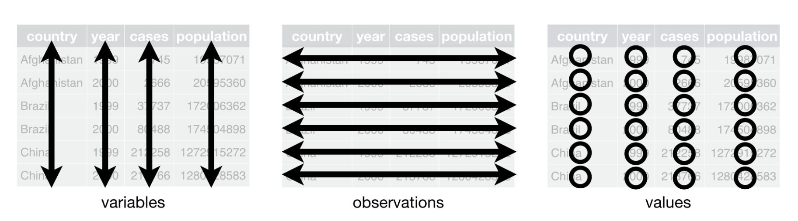

```{r}
here::i_am("skills/ds_structured_data.qmd")
```



:::{.callout-note appearance='default' icon=true}

## Session outline

### Sentence aim
This session is about how to collect data once you've thought about how to data-fy your system. We'll introduce a big idea about how to structure data - which we'll call **tidy data**. We'll also do some reminders about types of data, and give some simple hints about how to best collect data to ensure that it's safe and useful for your work.

### Exercises

+ E1: splitting things up
+ E2: values, variables, and observations
+ E3: precision 
+ E4: accuracy

### Data

[Download dataset as .xlsx](data/distributions_data.xlsx) (or [as .rds](data/distributions_data.rds)).

### Key concepts

* precision 
* accuracy
* tidy data
* the power of being selective

:::


## Introduction

Three sessions ago, we talked about some example datasets:

+ a month-by-month count of patients visiting our hospital for the last two years
+ census data, showing demographics of different towns in Scotland
+ survey data estimating how many people are currently homeless nationally

In that first session, we mainly talked about how data sets such as these might be used. In the previous session, we began talking about how to go about making such datasets. In that session, we introduced the idea of  our system as a way of talking about making clear (to ourselves, and to others) some of the more important assumptions about that system.

In this session, we're going to start by assuming that you have a datafied system ready to go: you've thought about why you're collecting the data, you've selected the most salient aspects of your system to collect data about, and you've begun thinking about a data dictionary to set down your most important assumptions about how that data will work. That's a lot of work already done, especially at the conceptual end of things.  If we're thinking about the three example datasets above, we might have decided to collect data from the following aspects of our systems:

* adding up all the attended inpatient and outpatient appointments each calendar month for our hospital site
* asking everyone in Scotland to complete a census return every few years, and asking questions about employment, housing, and so on
* requesting services supporting the homeless to estimate how many service users they saw during one specified week last year

Most of the content in this session concentrates on the technical aspects of collecting and structuring data so that its most useful across different data journeys. We'll start with a few words about measuring, and then move on by introducing the idea of tidy data, do a quick reminder about different types of data you're likely to encounter, go on to talk about tips and tricks that might be useful when collecting different kinds of data, and then finish by talking about how you can effectively communicate what you've done when collecting data.

## Measuring things

Understanding measurement is a life's work in its own right, so we'll be brief here. Data comes from measurements. For most of us in health and care, when we're collecting data, we're effectively re-using measurements that are made for other purposes. For example, we (as analysts) don't usually have to collect service users names and addresses from them personally, or stand there with a clip-board counting people that phone our service, or go round measuring people's blood pressures ourselves. Nearly always, we're collecting data opportunistically, effectively re-using measurements that are mainly made for other reasons. 

## Tidy data



In this section, we'll introduce the term  as one way of thinking about how to organise data in a safe and effective way. The term tidy data is [generally associated with data work in R](https://r4ds.hadley.nz/data-tidy), but the principles of tidy data apply beautifully to other areas of data work. One reason that tidy data is so useful is that it provides a minimal set of standards for organising our data that are easy to apply, easy to check, and that each directly contribute to safe and effective analysis. In fact, there are only three rules that we need to know and understand to make our data tidy.

In brief, these rules are:

1. separate your values
1. put your  in columns
1. make each row a separate 

### Values

Value just refers to a single piece of information in our dataset, like a date, a number, a name, etc. To make our data tidy, just make sure each value is separate. That sounds too obvious to be worth saying, but it's common to see spreadsheets with multiple values per cell. Don't do this!

```{r}
tibble::tibble(value = c("77 (2.1%)", "88 (2.4%)")) |>
  knitr::kable()
```

Those values should be split into separate columns:

```{r}
tibble::tibble(value = c("77 (2.1%)", "88 (2.4%)")) |>
  tidyr::separate_wider_delim(cols = value, names = c("value", "percent"), delim = "(") |>
  dplyr::mutate(percent = stringr::str_remove(percent, "\\)")) |>
  knitr::kable()
```

This sort of case is fairly simple to deal with, but do be aware that like most data work, there's judgement involved in most cases, and often data can potentially be separated out in several different ways. Let's explore that now:

:::{.callout-note collapse=false appearance='default' icon=true}
## Task one: splitting things up

Here are several pieces of data that might be split up in different ways. How would you choose to record them?

+ Alan M. Bates
+ 318 Bank Street, Plockton, Ross-shire, IV52 8TP
+ the 163 phone calls we received yesterday
+ a blood pressure of 141/82 mmHg

Suggestions in the chat, please! Likely context will make a difference here, so do please make suggestions if one way of doing things seems especially suited to one purpose.

:::

In general, you should try and think about your purposes when deciding what counts as a value. Names are a good example, where they might be recorded as a full name, or as first/middle/surname trio, or first + initial and surname. Having the surname independently is important, because that's often used for alphabetising names. In this case, I'd probably try to think about the purposes. If we wanted to use the surnames and first names independently (writing a letter from the data, for instance), having that data pre-separated would probably be helpful.

Whichever separation you use for your data, remember to keep a note, because describing your data carefully is the basis of your data dictionary. 

### Variables

Your dataset should be arranged into . We define a variable as a collection of measurements of one specific characteristic of our system. For example, if we collected daily counts of the number of new patients and discharged patients for several hospital sites, that data set would have four variables: the date, the hospital site, the number of new patients, and the number of discharged patients. The important idea is that each value in that column is similar: they're all dates, or hospital sites, or numbers of new patients, or whatever.

Conventionally, each variable occupies a column. Most statistical software (including Excel) is designed to work with columns as variables. For example, there are usually short-hand ways of referring to all the values in a column which make it easy to (for example) find the average of that column (=variable). That makes it important to ensure that each value in our variable is the same  of data, because we're usually only able to summarise a group of values when they're all the same type:

:::{.callout-note collapse=false appearance='default' icon=true}
## A reminder about types of data

From session two, we introduced three main types of data that we'd commonly encounter:

+  data
+  data
+  data
:::

### Observations

Finally, each row in our dataset will contain one . I think an observation is best understood as a single measurement of all our variables. It might be helpful to illustrate that with an example. Here is some sample data from a survey generously provided by KIND members:

```{r}
library(dplyr)

readr::read_rds(here::here("skills/data/distributions_data.rds")) |>
  slice(1:5) |>
  knitr::kable()
```

[Download dataset as .xlsx](skills/data/distributions_data.xlsx) (or [as .rds](skills/data/distributions_data.rds)).

Here, each row in our data is one set of survey responses from a single respondent. They belong together: even though they're several different values, because they come from one individual they belong together as a group. We'll call these groups . 


:::{.callout-note collapse=false appearance='default' icon=true}
## Task two: values, variables, and observations

Here's some data about a care service presented in a narrative way:

> On the first of November, we had three new referrals, and discharged four clients from the service. The next day, we had no new referrals, and only discharged one client. For each of the next three days, we had one referral a day, and no discharges.

Please decide how best to record this data. You'll need to decide:

+ what your variables are, and what you might call them
+ what might be the most sensible way of structuring observations
+ how you record your values

Please sketch that data out. You can use paper, Excel, or whatever's convenient.

:::

## Precision and accuracy

In the above example, we didn't really think about how our data came about. In the next section, we'll introduce two ideas that are important when we're thinking about how to collect our own data. These are the linked ideas of precision and accuracy. They describe two ways of communicating how well our data reflects what happened in our system.

Even simple data can be misleading. For example, let's think about one simple piece of data we recorded above. Imagine that we're collecting data about the number of phone calls our service receives. We find out that the service received 163 phone calls yesterday. How well does that piece of data (163 calls) reflect what happened in our system?

To answer that, we need to think about the process of measuring and reporting that piece of information. Let's deal with the reporting first. I'd guess that this 163 is meant to reported to the nearest whole number. Note though that we could have reported this data to lowest levels of precision:

- 165 phone calls (to nearest 5)
- 160 phone calls (to nearest 10)
- 200 phone calls (to nearest 100)
- 0 phone calls (to nearest 1000)
- "loads of calls" as an informal measure

This group of different estimates shows us several different levels of precision on our measurement, from the most precise (165) to the least (loads of calls). 

:::{.callout-note collapse=false appearance='default' icon=true}
## Task three: precision

Which of those different levels of precision in the example above should we prefer?

How precise would you think the following values are:

* "half a minute"
* 33.12 seconds
* 33000 milliseconds
* 0.552 minutes

Can you rank them from most, to least, precise?
:::

It might feel like more precision is always going to be better. That's unfortunately not true, because we can definitely be over-precise. Saying we received 163.00 calls is completely senseless: the smallest-possible unit of phone call is 1, and adding the .00 mis-represents how our measurements worked. So we definitely shouldn't go being as precise as we can without understanding the limitations of the measurements we're reporting.

That brings us on to accuracy. Accuracy describes how well our measurement of a system reflects what happens in that system. To illustrate, compare a few different ways of counting phone calls to our service:

- we could take data from our phone system, to see how many incoming calls were received that lasted longer than ten seconds
- we could count calls by asking everyone who works with us to report the number of calls they received
- we could stand in the middle of our open-plan office, and count the number of times that phones are heard to ring

Those methods are likely to lead to different estimates of the number of calls. Imagine that we had a perfect method for counting the 'true' total number of calls. Accuracy is the closeness of each method to that 'true' total number of calls.^[How we decide that 'true' total number is a discussion for another place, but we could think of this as being the same as our best-possible measurement of the number of calls.] I'd imagine that, of these methods, that the computer-counting would be most accurate, then probably asking staff, followed by listening for ringers which feels like the least accurate method.

There are ways of representing accuracy properly which we'll avoid for now. But even giving an informal estimate of our accuracy is likely to be extremely useful. For instance, we could express a likely range that our number of calls might fall into. We might guestimate values like:

- phone system data might be 163 +- 2, because we might miss the odd real (but very short) call
- aggregating counts might depend on the number of staff we're talking to, but maybe something like 163 +- 10 as a likely range
- I think counting rings is just going to be wildly inaccurate, so maybe that's 163 +- 100 calls

Accuracy and precision are a double-act. I'd expect the precision of a measurement to reflect the accuracy with which we measured it. One very tidy way of doing this is to match your stated precision to your estimated accuracy. 

- phone system data might be 165, to the nearest 5
- aggregating counts might be 160, to the nearest 10
- counting rings is perhaps 200, to the nearest 100

This is quite experience-based, so we won't give hard-and-fast rules. But definitely err on the side of less precision, because seeing a value expressed with extreme precision strongly implies that it has been measured very accurately too. And a common problem with data is that it contains values that are expressed showing more decimal places or significant figures than the actual measurement would support.

:::{.callout-tip collapse=true}

## Decimal places and significant figures

A quick reminder about two ways of describing how numbers are expressed. Say we're looking at the following data:

| Values |
|--------|
|  33.1 |
|  28.0 |
| 041.9 |

All of these values are reported to one decimal place, because each has one number after the decimal point. They're also all reported to three significant figures. That's a bit more complicated to calculate:

* read the number left-to-right
* start counting when you encounter the first number that isn't zero
* finish counting when all the numbers are counted

You'll see both methods used in different places, so it's important to be familiar with each. 

:::

:::{.callout-note collapse=false appearance='default' icon=true}
## Task four: accuracy

Many data tools can give misleading estimates of precision. Say I'm back estimating the number of phone calls. I sit in the office, counting calls by the poor-accuracy method of counting rings, and come up with a total of 33 rings in over the course of a (very dull) seven hours shift.

* use Microsoft Excel (or your preferred data tool) to calculate how many calls I heard per hour
* pay attention to how that result is reported. Does it 'naturally' appear with a good and sensible number of digits?
* what method(s) might you use to correct that apppearance?

:::

## Be more selective

What do you need to report on? What's a nice-to-have? What's not needed?

In the session about datafying, we discused why being selective matters. That's largely because the point of data work is to make complex systems more simple, and easier to understand. Let's revisit that general advice in the context of collecting data.

Most data projects end up collecting data 'just because'. For example, we collect data that's easy to find and report. For example, we run lots of activities using Microsoft Teams. That contains a very simple suite of analytical tools, summarising the daily number of:

* active users
* posts on a channel
* replies to posts
* meetings
* reactions (like thumbs-up'ing a post)

All of these are easy to collect from the Teams app, and so if you're thinking about collecting data it feels tempting to collect all of this, and whatever else can be conveniently collected. This most urgent piece of advice from this section: **you should probably resist the temptation to collect everything**. Instead, a key idea in data work is that you should be as selective as possible, and collect as little data as you can reasonably get away with.^[We're aware this advice is potentially heterodox advice. Especially in the context of increasingly-capable data tools, and data practices that have developed in the surveillance-ish world of online digital services, most data tools tell you to collect whatever you can. There's probably an important distinction to be drawn here between the kinds of fully-designed and fully-online systems that many data techniques were developed in, and the kinds of largely-accidental and mainly-offline systems most health and care work happens in that might underwrite a sensible set of reasons for us urging minimalism about data, but this probably isn't the right place to develop that argument.]

Being selective about the data you collect has practical, professional, ethical, and legal advantages. Practically, we should beware collecting everything, because the more data we have, the harder it is to manage, and quality assure. For example, I don't know what Teams counts as an active user, and think it'd take a long time to discover exactly what that means. I'd also need to periodically check that, as often happens with evergreened software, that the definition of active wasn't subtly changing behind the scenes, potentially giving me a problem with consistency of my data over time. 

The professional advantage of being selective comes from the idea that you need expert domain knowledge to understand exactly what a piece of data tells you about your service.  If you can't relate your data back to a question about the data, don't collect it. You should, as a matter of professional skill, know what you're aiming to understand with your dataset.

Ethically and legally: there's no better-safe-that-sorry principle that suggests you should just collect everything and work it out afterwards. Sometimes easy data collection can come at a cost of real harms. In our context, there are strict legal controls that govern what data may be collected and retained. Those err strongly on the side of collecting less data, and only allowing data that relates to some clear purpose, being retained.

That said, trying to draw conclusions from not-enough data is either very hard or impossible, as we'll explore in one of the later sessions. This means that we urge a deep-but-narrow approach to collecting data. Your interests will probably be best served by getting as much data as you can about as few aspects of your system as you can reasonably get away with. That allows you to establish good conclusions that will let you understand and improve key aspects of your system, all while ensuring that the quality of the data you collect is as high as possible with a reasonable amount of effort.

<!-- ## Decide how to report your data -->

<!-- While there's usually not much to think about with numerical data than  -->

<!-- based on the satisfaction example from s2 - where we had "high", "medium", and "low". Could potentially code those as 1/2/3 or something and treat them more like a numeric value -->

<!-- ## Missing data -->
<!-- Mention here and trail main explanation in session 7 -->


<!-- ## Communicating what you've done -->

<!-- Back to the data dictionary idea from the previous session -->

:::{.callout-note collapse=true appearance='default' icon=true}

## Glossary

```{r}
#| echo: false
#| output: asis

glossary <- yaml::read_yaml(here::here("glossary.yml"))

glossary <- glossary[order(names(glossary))]

for (term in names(glossary)) {
  cat("### ", term, "\n\n", glossary[[term]], "\n\n", sep = "")

}
```
:::

