```{r}
library(stringr)

hl <- function(text, regex){
  # function to highlight regex-matched text in light green
  # not useful here, but will be great for the regex in R session
  
  result_string <- stringr::str_replace_all(text, paste0("(", regex, ")"), paste0("<span style='background-color:lightgreen'>", "\\1", "</span>"))
  
  regex_string = paste0("`", gsub("\\\\", "\\", regex, fixed = T), "`")
  
  tibble::tibble(regex = c("input", "result"),
                !!regex_string := c(text, result_string))  |>
  knitr::kable()
  
}
```

## Introduction
This session is intended as a beginner's introduction to regular expressions. You should have some prior experience of trying to match and parse free-text data to enjoy this session, and you'll definitely need to have past experience of reading and writing code. That doesn't need to be very advanced - if you're broadly happy with a lookup formula in Excel, for example, you'll be fine. But this session is code-based and likely to be unsuitable as a first introduction to programming.

## Structure

- What's the problem with GGC?
- string literals
- meta-sequence for matching digits, words, and white-space
- quantification and ranges
- anchors and capturing groups
- practical

## What's the problem with GGC?

```{r}
ggc_full <- readr::read_csv(here::here("skills/src/ggc_names.csv")) 
non_ggc <- readr::read_csv(here::here("skills/src/non_ggc_names.csv"))

ggc <- ggc_full |>
  dplyr::slice_head(n = 5) |>
  dplyr::pull() 
```

In the KIND network, we have hundreds of members employed by NHS Greater Glasgow & Clyde (NHS GG&C). When people [join the network](https://forms.office.com/pages/responsepage.aspx?id=veDvEDCgykuAnLXmdF5Jmn79kl25VpJIq3eErXXCYKBUMUpENjBJOENINDRFMUlYQTlCM1RVNzRSRy4u&route=shorturl), we ask them to fill in a free-text field asking for their organisational affiliation. That gives rise to an interesting problem, because there are many different variants of NHS GG&C that people might use. To pull some examples from our submissions, someone could call it **`r ggc[1]`**, or **`r ggc[2]`**, or **`r ggc[3]`**. In fact, that form has received over a hundred different permutations and versions of NHS GG&C over the years.

It's also received a lot of other, non-NHS GG&C, organisation details too. For example, we have members who record their affiliation as **`r non_ggc$non_ggc_names[3]`** or **`r non_ggc$non_ggc_names[7]`**. Ideally, we'd like to be able to find a way of recognising text with some kind of allowable variations. This is what regular expressions (regex) do: they a way of matching variations in text.

## regex101.com

Regular expressions are implemented in many coding languages, and in the more recent versions of Excel. For this session though we'll use a free-to-access regex writing tool: [regex101](https://regex101.com):

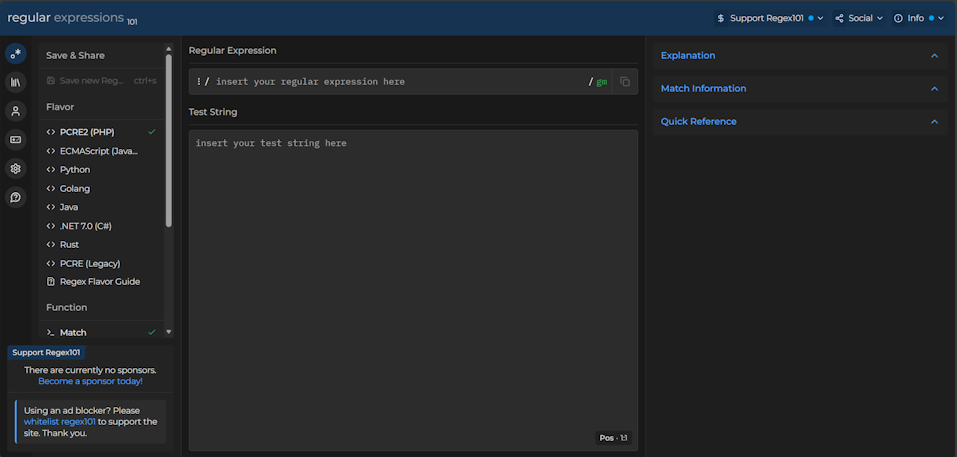

Do note that [regex101](https://regex101.com) isn't suitable for any real data at all, and should only be used with synthetic examples. But it's a great training tool, not least because it gives explanations of how your regular expression is working.

To setup, please copy the five names in the GG&C list:

```{r}
paste("  \n+", ggc_full$ggc_names[1:5], collapse = "") |>
  cat()

```

Now paste them into the `Test String` area of [regex101](https://regex101.com).

## GGC regex example

All of these starter examples contain the string "GG&C", which makes detecting these five easy. Our first lesson about regular expressions is that regular expressions can detect **string literals**, which are snippets of text that you want to match exactly.

Try adding the regular expression `GG&C` to the `Regular expression` area of [regex101](https://regex101.com), and seeing what happens:

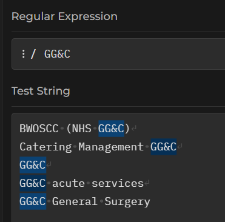

You should see that each line of test text now has a highlighted region, showing that our regex corresponds to at least part of each one of these GGC permutations.

Using a character, number, most punctuation marks, or string as our regex will match that character, number, or whatever, wherever it appears. This sort of literal matching is case-sensitive. For example, add the following text to your test strings:

```{r}
ggc_full$ggc_names[22] |>
  cat()
```

Our `GG&C` regex won't match that one:

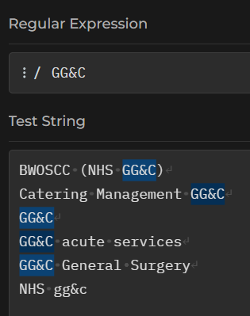

We could also have tried to match single letters/words, numbers, or (most) punctuation marks:

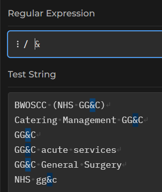


Now please add the following points to your pool of Test Strings:

```{r}
paste("  \n+", ggc_full$ggc_names[str_which(ggc_full$ggc_names, "\\.|\\d")], collapse = "") |>
  cat()
```

One of these points contains a full stop, so as a final task for this section, please try to find that full stop using a string literal...

## Meta sequences

If we try to find a `.` character in our text, we get an unexpected result:

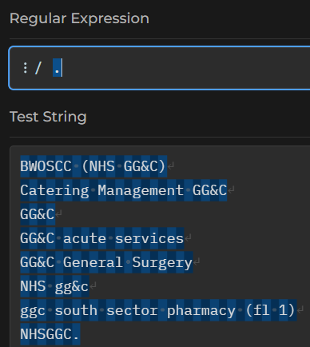

If you really want to match `.`, your regex will need to be `\.`. That's because `.` on its own is a meta-sequence. That means that it matches many characters, rather than just one. `.` is the broadest of these - it matches **any** character. There are lots of these, but the most common meta-sequences are:

`\d` to match a digit:

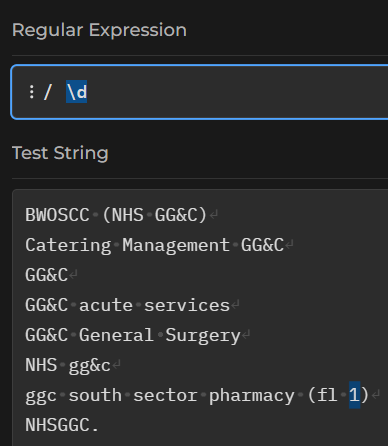

Switching the case of the meta-sequence reverses the meaning. As `\d` matches digits, so `\D` will match non-digits:

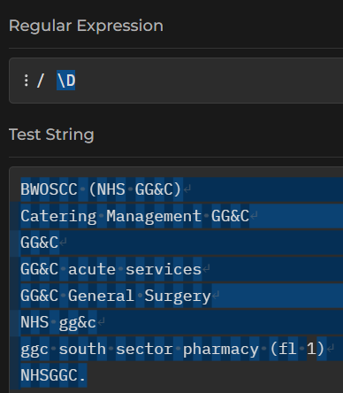

That matches everything that isn't a digit - spaces, letters, punctuation, the lot. If we wanted to match just word characters, we'd use `\w`:

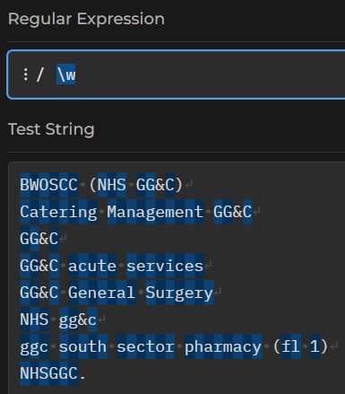

(do just note that word characters include numbers, letters, and underscores, but no other punctuation)

`\s` will find the white-space, and `\S` the non-white-space - i.e. the printing characters:

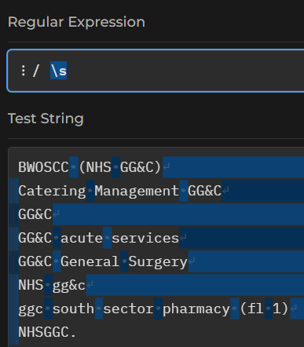

## Quantification

Regex has several ways of counting letters. For your regex, start with a single, capital, `G`. Immediately afterwards, please try the following three shorthand ways of counting:

* `G+` finds at least one G in a row (so `G`, `GGG`, etc)
* `G*` finds 0 or more Gs in a row (so will match any string length of repeating Gs, including none - making it optional)
* `G?` makes G optional in a string

I find those confusing, so if I ever do really need counting precision, there's a more explicit way of doing the same thing with curly brackets. The general format is `{smallest, largest}`. So `G{,2}` matches 0-2 Gs in a row, for instance.

## Ranges

Being able to count letters is useful enough, especially since we can effectively make letters optional by asking for 0 occurrences. There's a more powerful way of getting regexs to deal with optional characters. Try the regex `t[eho]` in regex101.com:

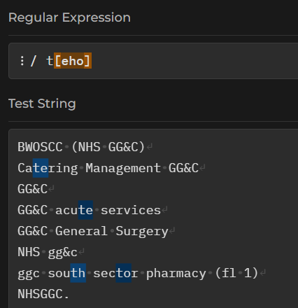

If we put some letters into those square brackets, our regex will match any one letter. In this example, our regex matches a `t`, and then a choice of either `e`, `h`, or `o`.

We could also use a `-` to indicate a range of letters that we'd like to match. So `t[e-t]` will match a `t` followed by any single letter from `e` to `t`:

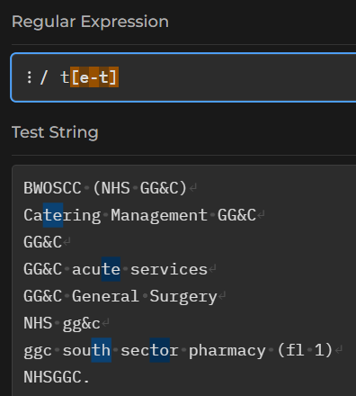

We could add several ranges inside one set of brackets - if you look at regexes in the wild, you'll often see `[a-zA-Z]` as a way of matching any letter character, because that's not readily possible using the standard word/whitespace/digit meta-sequences.

## Anchors

So far, our regexes have just matched small chunks of strings. How would we match an entire word (or line) containing a match? The answer depends on understanding anchors.

Try a new regex `^`. That should show a line at the left-most margin of your test strings:

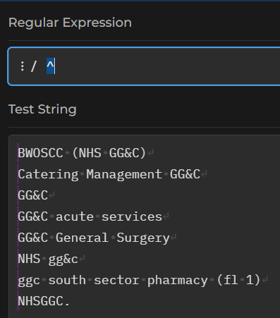

Similarly, the regex `$` should show a line at the right-hand margin: 

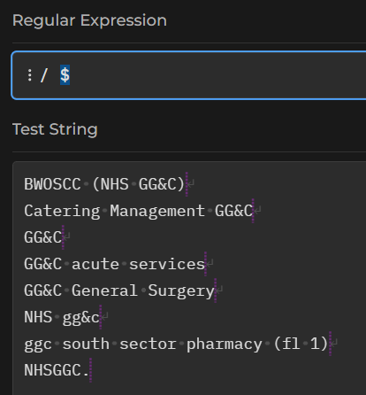

The `^` and `$` characters are anchors, indicating the start and end of a line of text respectively. We could match every line - including blank ones - with `^.*$`:

Or any line containing `NHS` with `^.*NHS.*$`, read as "start the line, then any number of characters, then NHS, then anything you like, then the end of the line:

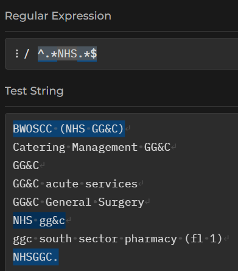

As well as line anchors, you can also specify word boundaries using `\b`. So `NHS\b` should find `NHS` at the end of a word, where no word character follows it:

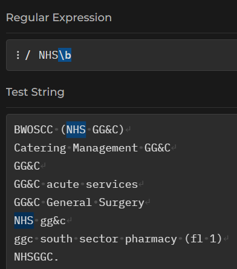

Note that - again - we're just matching those few characters with this example. How would you re-work the regex to select the entire line that matched `NHS\b`?

## Groups

So far, our regular expressions have just matched a piece of text, and then selected either that piece of text (as the early examples in this session) or selected an entire word/line containing that match. Regular expression can also work in a more sophisticated way, where we can specify a piece of text to match, and also (independently) specify a piece of text to select. To do that selection, we'll use the idea of groups. Groups are formulated using round brackets - so anything contained within `()` will be selected, assuming any of the regex outwith those brackets is matched. As an introduction, try the regex `NHS (GG&C)`:

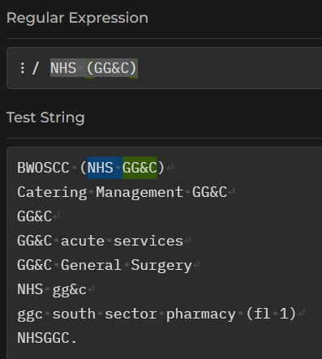

That should select only `GG&C` when it follows NHS with a space. In other words, `NHS (GG&C)` is matched, but only the `GG&C` part is selected. We could tweak that to also pick up the final string in our test pool with a bit of quantification:

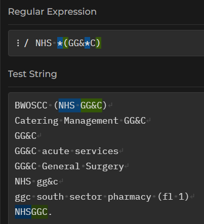

## Practical exercise

For the final few minutes of the session, we'll do an exercise in Excel or R depending on your preference. The task is simple: please accurately classify some sample responses into NHS GG&C/non-NHS GG&C these responses. I believe there are 10 responses from GGC, and 13 not from GGC in the sample data.

::: {.panel-tabset}


### Excel version

This requires M365 Excel - either [the web version](https://excel.cloud.microsoft/) or the desktop version are fine. Create a new workbook, and then copy and paste the following names into Excel:

```{r}
trial_names <- ggc_full |>
  dplyr::slice_sample(n = 10) |>
  dplyr::select(non_ggc_names = ggc_names) |>
  dplyr::bind_rows(non_ggc) |>
  dplyr::arrange() |>
  dplyr::select(names = non_ggc_names) 

trial_names |>
  knitr::kable()

# trial_names |>
#   readr::write_rds("skills/src/r_regex.rds")
```

There are three regular expression functions in Excel.

`REGEXTEST` is the easiest to use. The syntax is `REGEXTEST(string, regex)`, and you should be able to supply any of the regex examples from this session directly. As the name suggests, this function returns TRUE/FALSE. 

`REGEXEXTRACT` - an Everest of a name for those of us with dyslexia - will extract just the matching text from the regex using similar syntax.

`REGEXREPLACE` - probably not directly useful for this task, but allows regex-based find and replace


### R version

Please [download the rds file](src/r_regex.rds) and import into R. While there are several ways of working with regular expressions in R, I'd heartily recommend having the stringr package installed and attached for this exercise.

One R-specific gotcha: any regex that contains a `\` needs doubling in R - so `\w` becomes `\\w` etc.

`stringr::str_detect` is an excellent way to discover if a regex appears in some text.

:::

## Acknowledgements
I'm especially grateful to Ben Harley, Kirsty Mangin, Brian Orpin, and Donna McLean for helping to prototype this session
