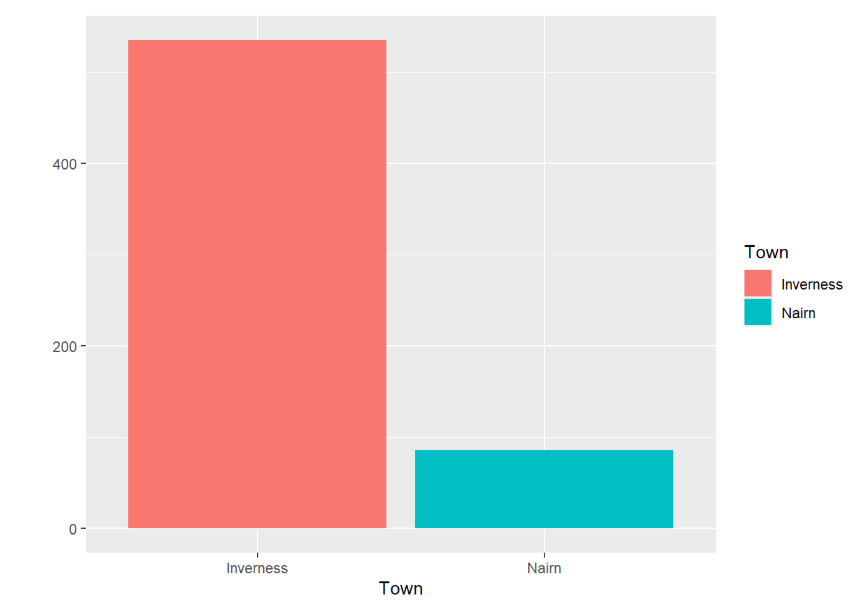
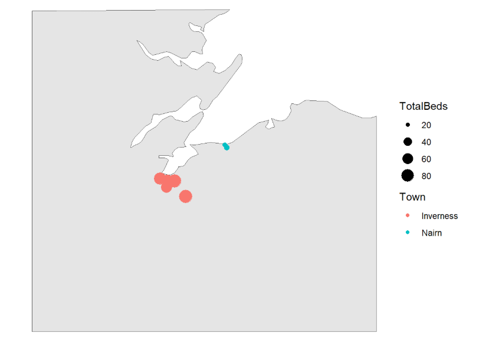

## Your job today!

* This is a first attempt at a new kind of training
* I have lots of areas of uncertainty about how this will translate to a live session
* This is 100% not a proper training session yet: don't come expecting a finished product
* It will go wrong, I promise
* I need you to interact: tell me what's going on with you, what you think, and ways that we might make this better
* Don't be nice, please! Be honest.

## This course

- a multi-part introduction to data work designed for health and care staff
- based on the idea of the data journey
- assumes no prior knowledge of data work or statistics
- aims to help you build skills that are closely-aligned to your work
- assumes very basic Excel (or similar skills) to demonstrate key concepts

## This session

- we'll take a small dataset about beds in care homes
- we'll use it to follow the data journey in miniature
- we'll aim to explain why data is useful in understanding how health and care systems really work by working through a series of exercises

## Exercises

- E1: have a look at a dataset, and think about what it might let us do
- E2: think about how you might have made this data, and how that might change how you use it
- E3: practical about summarising the data in different ways
- E4: thinking about purposes: how might different summaries change how you think about the data
- E5: thinking about different ways of visualising this data
- E6: homework - take an extended dataset

## Data

* for this course, we'll think about data as **structured information, usually numerical, that tells us about part of a system**
* this session uses some publicly-available data from the Care Inspectorate, which tells us about the 15 care homes for older adults in Inverness and Nairn. 

::: notes
This session aims to help you understand what data is, how data helps us do good work in health and care, and what we need to know about data to achieve that. Here, we'll explore the idea that data is an especially powerful way of understanding how systems in health and care really work. That's because data is an excellent way of answering some of the most important questions about our work, such as:

- "is our hospital busier than it was last year?"
- "do we have proportionally more children than average in our town?"
- "how many people are currently homeless in Scotland?"

This course will give an introduction to answering these questions using data. For the purposes of this course, we'll think about data as **structured information, usually numerical, that tells us about part of a system**. Specific examples of datasets that might help us answer our three questions above:

- a month-by-month count of patients visiting our hospital for the last two years
- census data, showing demographics of different towns in Scotland
- survey data estimating how many people are currently homeless nationally
:::

## Some data

```{r}

library(dplyr)
library(readr)
library(here)
ci <- read_rds(here::here("skills/data/care_inspectorate.rds"))

ci |> select(Name, Town, TotalBeds) |>
  knitr::kable()

```

## Task one: inspect your data

::: {.callout-note collapse="false" appearance="default" icon="true"}
<!-- - download the [dataset as an Excel file](data/care_inspectorate.xlsx) to your computer -->
<!-- - open it in Excel (or whichever tool you're planning to use for this session) -->
<!-- - we're just going to look at the file for now, so don't fiddle with it! -->
- discuss the data:
    - what do you see here?
    - what questions might it let you answer?
    - see if there are any areas that you might want to add or tidy up
:::


## Questions for this session

::: {.callout-important collapse="false" appearance="default" icon="true"}
- How many care home beds are there in total in Inverness and Nairn together?
- How do the beds available for different main areas of care compare?
- Does Inverness or Nairn have more care home beds? What's the right way of comparing the two?
- Is there some kind of relationship between the size of care home, and their town?
:::


## How do we answer questions like these?

If we want to answer a question about our system using data, we need to complete several linked steps in order:

- to collect and tidy our data
- to summarise that data
- to visualise that data
- to communicate those findings to others

We call this **the data journey**

## Tidying data

(This data is pretty tidy already!)

- it's narrowly focused on a topic
- it's structured, meaning that we've organised it in a standard way
  - each row (running horizontally) is about one care home
  - each column (running vertically) describes one aspect of our system
- there's no missing data
- the values in each column are consistent (so one column is all postcodes, another all numbers, etc)
- and we seem to have standard coding for each value
- and the text and postcodes seem to be nice and clean, with no weird spellings, formatting, cases, etc

::: notes
As we'll see, collecting data like this can be complicated. My understanding is this actual data comes from annual returns submitted to the Care Inspectorate. Just as an introduction, we'll now do a short exercise to think about how you might go about collecting data like this:
:::

## Task two: how might this data have been made?

::: {.callout-note collapse="false" appearance="default" icon="true"}
This is a group discussion. We'll spend a couple of minutes thinking about ways that this data might be collected. You might like to think about:

- how would you identify individual care homes?
- how could you be sure that you hadn't missed any care homes in the area?
- how would you decide which establishments were in which towns?
- how might you find out what the main area of care provided is?
:::

## An example about datafying

| Town                   | Population (2022 census) |
|------------------------|--------------------------|
| Inverness and Culloden | 65053                    |
| Nairn                  | 9582                     |

::: notes
As that discussion (hopefully) revealed, there are lots of practical and conceptual issues underlying this sort of simple data. Those issues, and the ways we approach them, are the basis for sessions 3 and 4 of this course. They're important, even for people who aren't planning to do any data collection themselves. For example, one of the exercises that we're going to try later in this session brings in a tiny bit of new data from the [2022 census](https://www.scotlandscensus.gov.uk/), which gives us the following estimates for the population of our two towns:

Here's one reason why understanding the route by which data was collected matters. Our care home data talks about "Inverness". But the census data talks about "Inverness and Culloden". Are they the same thing? If not, how might you need to change your population estimates to make sure we're talking about the same places in the same way as the Care Inspectorate?

We'll leave the discussion about that issue for another session. Now though, let's introduce one of the big ideas in data literacy: summarising.
:::

## Summarising data

* We've got data about 15 care homes in this dataset
* How could we simplify that?

:::{.notes}
We've got data about `r nrow(ci)` different care homes in our dataset. One of the standard approaches would now be to try and boil that down to a smaller number of values - ideally one! - that tells us about these care homes. Probably the most commonly-used way of summarising would be to add all the values together, to give us a sum. Let's try that now.
:::

::: {.callout-note collapse="false" appearance="default" icon="true"}
## Task three-a: sum

- add all the values in the `TotalBeds` column
- report your value in the chat. What does it tell you?
:::

## Another way of summarising

- what's the typical number of beds in on of our care homes?
- if we only had two or three values (say `r paste(ci$TotalBeds[1:3], collapse = ", ")`), perhaps we could estimate that by eye - about 40??
- but we have too many values to do that in our real data:

```{r}
paste(ci$TotalBeds, collapse = ", ")
```

## The mean

- take our sum total
- divide it by the number of homes

$$Mean = {Sum \over n} = {621 \over 15} = 41$$

## Task three-b: practical about summarising the data in different ways

::: {.callout-note collapse="false" appearance="default" icon="true"}
- take a mean of the values in the `TotalBeds` column
- In Excel, you can use `AVERAGE()` - or you can divide your total by a `COUNTA()` of your values
:::

## Groups

We'll talk much more about groups in later sessions, but for now, please note that our care homes data has a column about the main area of care that the home provides. Using that area of care as a grouping variable lets us investigate lots of issues about the size of care homes in our sample:

```{r}
ci |>
  group_by(Main_area_of_care) |>
  summarise(Total = sum(TotalBeds),
            Mean = round(mean(TotalBeds), 1)) |>
  knitr::kable()
```

## Comparing data

How do the number of beds vary between the two towns?

```{r}
read_rds(here("skills/data/care_inspectorate.rds")) |>
  group_by(Main_area_of_care) |>
  summarise(TotalBeds = sum(TotalBeds)) |>
  mutate(`TotalBeds (%)` = scales::percent(TotalBeds / sum(TotalBeds))) |>
  knitr::kable()
```

## A question

- does Inverness or Nairn have more care home beds?
- what's the right way of comparing the two?

## Approach one

```{r}
read_rds(here("skills/data/care_inspectorate.rds")) |>
  group_by(Town) |>
  summarise(TotalBeds = sum(TotalBeds)) |>
  knitr::kable()
```

## Approach two

```{r}
read_rds(here("skills/data/care_inspectorate.rds")) |>
  group_by(Town) |>
  summarise(TotalBeds = sum(TotalBeds)) |>
  mutate(Population = c(65053,9582)) |>
  knitr::kable()
```

## Approach three

```{r}
read_rds(here("skills/data/care_inspectorate.rds")) |>
  group_by(Town) |>
  summarise(TotalBeds = sum(TotalBeds)) |>
  mutate(Population = c(65053,9582)) |>
  mutate(Beds_per_10000 = TotalBeds + 10000 / Population) |>
  knitr::kable()
```

## Visualising data

We can also use those groups to help us understand our data by visualising the number of beds available in each town:



## Map 

Or we could plot our different care home locations on a map:



## Task five: thinking about different ways of visualising this data


:::{.callout-note collapse=false appearance='default' icon=true}

+ There are many kinds of graphs in use. In the meeting chat, please could you tell us what kind(s) of graphs you use or see at work. If you can screenshot those into the chat without disclosing any sensitive information, that'd be a huge bonus!

:::

## Homework

Practising new skills is essential to make them stick. This course sets up little bits of homework: short and flexible tasks to allow you to put what you've learned in a session into practice.

:::{.callout-note collapse=false appearance='default' icon=true}
## Task six: homework - take an extended dataset

Here is an [Excel file](https://nes-dew.github.io/KIND-training/skills/data/care_inspectorate_full.xlsx) (or an [.rds](https://nes-dew.github.io/KIND-training/skills/data/care_inspectorate_full.rds)) of the full national Care Inspectorate data in the same format as we've been using in this session. Please use it to answer some questions:

+ Is there some kind of relationship between the size of care home, and their type (private, health board, etc)?
+ We know there's a difference in average size of care home between Inverness and Nairn. How might you visualise that, and what might a visual show you that the numeric average doesn't?


:::
