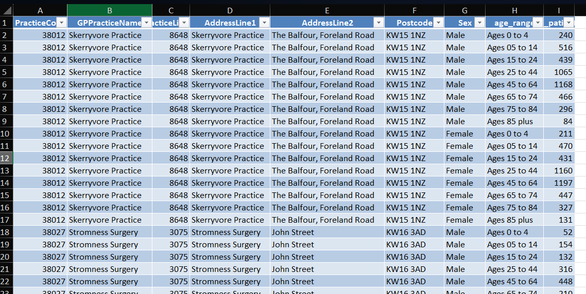
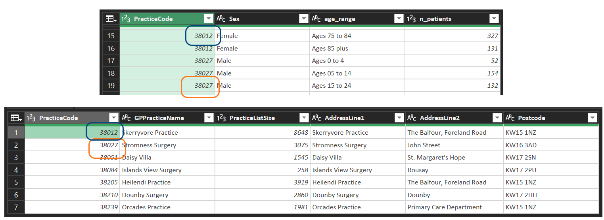

```{r}
#| results: asis
#| fig-align: left
#| fig-height: 0.6
#| fig-width: 3
#| echo: false

source(here::here("R/feed_block.R"))
feed_block(params[["id"]])

source(here::here("R/next_sesh.R"), local = T)
next_sesh(params[["fn"]])

here::i_am("sql/sql_scope.qmd")
```

## About this session

This session is a standalone introduction to SQL.

SQL, which is a query language that is widely used to manage data. In this session, we'll introduce the language, discuss where it's used, introduce some learning resources, and answer any queries. No specific experience or resources needed for this session, although do be aware that this is a code-based session and will assume you have some past familiarity with reading/writing code.

## What's SQL?

- SQL = Structured Query Language
- Coding language to create and manage databases
- The most widely-used language for data work
- First developed 1973
- Found *everywhere* - web, lots of EPR systems, in the back-end of lots of data products

## Databases

- specifically, **relational** databases

- Excel: put your related data together on a sheet
- Databases: put your data in tables, and connect them with relationships

## The Excel way




## The relational data way



## Why do that?

+ it's much more efficient:
    + Excel's way of doing things needs just over 1000 data points
    + our relational data needs just under 500 data points
    
```{r}
#| echo: false

library(dplyr)
library(readr)
library(dbplyr)
library(RSQLite)

gps <- readxl::read_xlsx(here::here("sql/data/orkney_gps.xlsx"), sheet = "gps")
demographics <- readxl::read_xlsx(here::here("sql/data/orkney_gps.xlsx"), sheet = "demographics")

conn <- src_memdb() # create an sqlite db in memory
copy_to(conn, gps, overwrite = T)
copy_to(conn, demographics, overwrite = T)
```

## What does SQL look like?

```{sql connection=src_memdb()$con}
SELECT * FROM gps;
```

* Keywords (like `SELECT`)
* table names (like `gps`)

## Compared to other languages

+ small
+ strict
+ variable

## Small

```{r}
#| echo: false

paks <- c(getOption('defaultPackages'), 'base')

r_number <- setNames(paks, paks) |>
  purrr::map(getNamespaceExports) |>
  unlist() |>
  length()

setNames(paks, paks) |>
  purrr::map(getNamespaceExports) |>
  unlist() -> nom

tibble::as_tibble(nom) |>
  dplyr::arrange(value) -> ming

R.version$`svn rev` == 89956
```

* comparatively few keywords:
    + SQL has [c.160 keywords](https://www.w3schools.com/sql/sql_ref_keywords.asp)
    + Excel has [c.530 functions](https://support.microsoft.com/en-us/office/excel-functions-alphabetical-b3944572-255d-4efb-bb96-c6d90033e188)
    + R has [`r r_number` functions](https://stackoverflow.com/questions/58476696/list-of-all-functions-in-base-r) in the default packages

## Dialects

- Lots of different standards

## Murder!

https://mystery.knightlab.com/